# Program: COPAUA0C

> **Message Queue Request Processor**
---

## Quick Reference

| Attribute | Value |
|-----------|-------|
| Program ID | `COPAUA0C` |
| Type | ONLINE |
| Lines | 1027 |
| Source | [COPAUA0C.cbl](../carddemo\app/COPAUA0C.cbl#L1) |
| Paragraphs | 42 |
| Statements | 0 |
| Impact Risk | **HIGH** — 25 programs affected |

> **View Source:** [Open COPAUA0C.cbl](../carddemo\app/COPAUA0C.cbl#L1)

## Business Purpose

This program is triggered by incoming message queue requests. It opens a request queue, extracts the request message, reads the request from the message queue, and processes the authentication. The program then reads cross-reference records and performs further processing. The outcome of this processing is not explicitly stated in the provided code, but it appears to involve putting a message back into the queue. The program handles the flow of messages between different systems or components, ensuring that requests are properly authenticated and processed.

**Used By:** System or Batch Scheduler  |  **Process:** Transaction Processing
## Migration Summary

| Attribute | Value |
|-----------|-------|
| Migration Complexity | **3/5** — The program's complexity stems from its interaction with message queues and the need to replicate this functionality in a modern cloud-based architecture. |
| Modern Equivalent | Kafka consumer or a message queue listener |
| Target Microservice | `message-service or auth-service` |

### How to Migrate This Program

First, identify the message queue technology to be used in the cloud, such as Amazon SQS or Azure Service Bus. Next, refactor the COBOL code into a modern programming language, such as Java or Python, to interact with the chosen message queue. Then, implement authentication and authorization using modern security frameworks and libraries. Finally, integrate the new service with other microservices and test the end-to-end workflow.

### Data Contracts (Input / Output)

The program consumes incoming message queue requests and produces authenticated and processed messages to be put back into the queue.

### Migration Risks

> ⚠️ Key migration risks include ensuring message queue compatibility, handling authentication and authorization correctly, and maintaining the integrity of the message processing workflow.

### Migrate These First

The following programs should be migrated before this one:

- [`MQOPEN`](MQOPEN.md)
- [`MQGET`](MQGET.md)
- [`MQPUT1`](MQPUT1.md)
- [`MQCLOSE`](MQCLOSE.md)

---

## Dependency Context

> This section shows how **COPAUA0C** connects to the rest of the system — who calls it,
> what it calls, and what data it shares. If linked programs exist, they must appear here.

### Programs That Call COPAUA0C (Callers)

*No programs call COPAUA0C — this is likely a top-level entry point or CICS transaction starter.*

### Programs Called by COPAUA0C (Callees)

| Called Program | Type | Line | Why |
|----------------|------|------|-----|
| [MQCLOSE](MQCLOSE.md) | None | 956 |  |
| [MQGET](MQGET.md) | None | 400 |  |
| [MQOPEN](MQOPEN.md) | None | 262 |  |
| [MQPUT1](MQPUT1.md) | None | 758 |  |

### Shared Data (Copybooks & Files)

#### Shared Copybooks

| Copybook | Also Used By | # Co-Users |
|----------|-------------|------------|
| `CCPAUERY` |  | 0 |
| `CCPAURLY` |  | 0 |
| `CCPAURQY` |  | 0 |
| `CIPAUDTY` | CBPAUP0C, COPAUS0C, COPAUS1C, COPAUS2C, DBUNLDGS (+2 more) | 7 |
| `CIPAUSMY` | CBPAUP0C, COPAUS0C, COPAUS1C, DBUNLDGS, PAUDBLOD (+1 more) | 6 |
| `CMQGMOV` | COACCT01, CODATE01 | 2 |
| `CMQMDV` | COACCT01, CODATE01 | 2 |
| `CMQODV` | COACCT01, CODATE01 | 2 |
| `CMQPMOV` | COACCT01, CODATE01 | 2 |
| `CMQTML` | COACCT01, CODATE01 | 2 |
| `CMQV` | COACCT01, CODATE01 | 2 |
| `CVACT01Y` | CBACT01C, CBACT04C, CBEXPORT, CBIMPORT, CBSTM03A (+8 more) | 13 |
| `CVACT03Y` | CBACT03C, CBACT04C, CBEXPORT, CBIMPORT, CBSTM03A (+8 more) | 13 |
| `CVCUS01Y` | CBCUS01C, CBEXPORT, CBIMPORT, CBTRN01C, COACTUPC (+4 more) | 9 |

---

## Dependency Graph

```mermaid
flowchart TD
    COPAUA0C["⬤ COPAUA0C"]:::target
    MQCLOSE["MQCLOSE"]:::callee
    MQGET["MQGET"]:::callee
    MQOPEN["MQOPEN"]:::callee
    MQPUT1["MQPUT1"]:::callee
    COPAUA0C --> MQCLOSE
    COPAUA0C --> MQGET
    COPAUA0C --> MQOPEN
    COPAUA0C --> MQPUT1
    CB_CIPAUDTY{{"CIPAUDTY"}}:::copybook
    COPAUA0C -.- CB_CIPAUDTY
    CBPAUP0C["CBPAUP0C"]:::coupled
    CB_CIPAUDTY -.- CBPAUP0C
    COPAUS0C["COPAUS0C"]:::coupled
    CB_CIPAUDTY -.- COPAUS0C
    COPAUS1C["COPAUS1C"]:::coupled
    CB_CIPAUDTY -.- COPAUS1C
    CB_CIPAUSMY{{"CIPAUSMY"}}:::copybook
    COPAUA0C -.- CB_CIPAUSMY
    CBPAUP0C["CBPAUP0C"]:::coupled
    CB_CIPAUSMY -.- CBPAUP0C
    COPAUS0C["COPAUS0C"]:::coupled
    CB_CIPAUSMY -.- COPAUS0C
    COPAUS1C["COPAUS1C"]:::coupled
    CB_CIPAUSMY -.- COPAUS1C
    CB_CMQGMOV{{"CMQGMOV"}}:::copybook
    COPAUA0C -.- CB_CMQGMOV
    COACCT01["COACCT01"]:::coupled
    CB_CMQGMOV -.- COACCT01
    CODATE01["CODATE01"]:::coupled
    CB_CMQGMOV -.- CODATE01
    CB_CMQMDV{{"CMQMDV"}}:::copybook
    COPAUA0C -.- CB_CMQMDV
    COACCT01["COACCT01"]:::coupled
    CB_CMQMDV -.- COACCT01
    CODATE01["CODATE01"]:::coupled
    CB_CMQMDV -.- CODATE01
    CB_CMQODV{{"CMQODV"}}:::copybook
    COPAUA0C -.- CB_CMQODV
    COACCT01["COACCT01"]:::coupled
    CB_CMQODV -.- COACCT01
    CODATE01["CODATE01"]:::coupled
    CB_CMQODV -.- CODATE01

    classDef target fill:#f85149,stroke:#da3633,color:#fff,stroke-width:3px
    classDef caller fill:#58a6ff,stroke:#1f6feb,color:#fff
    classDef callee fill:#3fb950,stroke:#238636,color:#fff
    classDef copybook fill:#d29922,stroke:#9e6a03,color:#fff
    classDef coupled fill:#d29922,stroke:#9e6a03,color:#fff,stroke-dasharray:5
    classDef transitive fill:#484f58,stroke:#8b949e,color:#c9d1d9,stroke-dasharray:5
```

> **Legend:** 🔴 Target program · 🔵 Direct callers · 🟢 Direct callees · 🟡 Copybook-coupled · ⚫ Transitive (indirect)

---

## Impact Ripple View

> **If you change COPAUA0C, what else could break?**

| Impact Metric | Count |
|--------------|-------|
| Direct Callers | 0 |
| Transitive Callers (callers of callers) | 0 |
| Direct Callees | 0 |
| Transitive Callees | 0 |
| Copybook-Coupled Programs | 25 |
| **Total Impact** | **25** |
| **Risk Rating** | **HIGH** |

**Programs affected via shared copybooks:**
- `CBACT01C`
- `CBACT03C`
- `CBACT04C`
- `CBCUS01C`
- `CBEXPORT`
- `CBIMPORT`
- `CBPAUP0C`
- `CBSTM03A`
- `CBTRN01C`
- `CBTRN02C`
- `CBTRN03C`
- `COACCT01`
- `COACTUPC`
- `COACTVWC`
- `COBIL00C`
- `COCRDSLC`
- `COCRDUPC`
- `CODATE01`
- `COPAUS0C`
- `COPAUS1C`
- `COPAUS2C`
- `COTRN02C`
- `DBUNLDGS`
- `PAUDBLOD`
- `PAUDBUNL`

---

## Statement Profile

## Control Flow

```mermaid
flowchart TD
    START([Program Entry])
    MAIN_PARA["MAIN-PARA"]
    1000_INITIALIZE["1000-INITIALIZE"]
    1000_EXIT["1000-EXIT"]
    1100_OPEN_REQUEST_QUEUE["1100-OPEN-REQUEST-QUEUE"]
    1100_EXIT["1100-EXIT"]
    1200_EXIT["1200-EXIT"]
    2000_MAIN_PROCESS["2000-MAIN-PROCESS"]
    2000_EXIT["2000-EXIT"]
    2100_EXTRACT_REQUEST_MSG["2100-EXTRACT-REQUEST-MSG"]
    2100_EXIT["2100-EXIT"]
    3100_READ_REQUEST_MQ["3100-READ-REQUEST-MQ"]
    3100_EXIT["3100-EXIT"]
    5000_PROCESS_AUTH["5000-PROCESS-AUTH"]
    5000_EXIT["5000-EXIT"]
    5100_READ_XREF_RECORD["5100-READ-XREF-RECORD"]
    START --> MAIN_PARA
    MAIN --> 1000_INITIALIZE
    MAIN --> 2000_MAIN_PROCESS
    MAIN --> 9000_TERMINATE
    MAIN --> 1100_OPEN_REQUEST_QUEUE
    MAIN --> 3100_READ_REQUEST_MQ
    MAIN --> 9500_LOG_ERROR
    MAIN --> UNTIL
    MAIN --> 2100_EXTRACT_REQUEST_MSG
    MAIN --> 5000_PROCESS_AUTH
    MAIN --> 1200_SCHEDULE_PSB
    MAIN --> 5100_READ_XREF_RECORD
    MAIN --> 5200_READ_ACCT_RECORD
    MAIN --> 5300_READ_CUST_RECORD
    MAIN --> 5500_READ_AUTH_SUMMRY
    MAIN --> 5600_READ_PROFILE_DATA
    MAIN --> 6000_MAKE_DECISION
    MAIN --> 7100_SEND_RESPONSE
```

## Paragraphs

### MAIN-PARA

| | |
|---|---|
| **Paragraph** | `MAIN-PARA` |
| **Lines** | 220 - 229 |
| **View Code** | [Jump to Line 220](../carddemo\app/COPAUA0C.cbl#L220) |

### 1000-INITIALIZE

| | |
|---|---|
| **Paragraph** | `1000-INITIALIZE` |
| **Lines** | 230 - 248 |
| **View Code** | [Jump to Line 230](../carddemo\app/COPAUA0C.cbl#L230) |

### 1000-EXIT

| | |
|---|---|
| **Paragraph** | `1000-EXIT` |
| **Lines** | 249 - 254 |
| **View Code** | [Jump to Line 249](../carddemo\app/COPAUA0C.cbl#L249) |

### 1100-OPEN-REQUEST-QUEUE

| | |
|---|---|
| **Paragraph** | `1100-OPEN-REQUEST-QUEUE` |
| **Lines** | 255 - 285 |
| **View Code** | [Jump to Line 255](../carddemo\app/COPAUA0C.cbl#L255) |

### 1100-EXIT

| | |
|---|---|
| **Paragraph** | `1100-EXIT` |
| **Lines** | 286 - 318 |
| **View Code** | [Jump to Line 286](../carddemo\app/COPAUA0C.cbl#L286) |

### 1200-EXIT

| | |
|---|---|
| **Paragraph** | `1200-EXIT` |
| **Lines** | 319 - 322 |
| **View Code** | [Jump to Line 319](../carddemo\app/COPAUA0C.cbl#L319) |

### 2000-MAIN-PROCESS

| | |
|---|---|
| **Paragraph** | `2000-MAIN-PROCESS` |
| **Lines** | 323 - 346 |
| **View Code** | [Jump to Line 323](../carddemo\app/COPAUA0C.cbl#L323) |

### 2000-EXIT

| | |
|---|---|
| **Paragraph** | `2000-EXIT` |
| **Lines** | 347 - 350 |
| **View Code** | [Jump to Line 347](../carddemo\app/COPAUA0C.cbl#L347) |

### 2100-EXTRACT-REQUEST-MSG

| | |
|---|---|
| **Paragraph** | `2100-EXTRACT-REQUEST-MSG` |
| **Lines** | 351 - 381 |
| **View Code** | [Jump to Line 351](../carddemo\app/COPAUA0C.cbl#L351) |

### 2100-EXIT

| | |
|---|---|
| **Paragraph** | `2100-EXIT` |
| **Lines** | 382 - 385 |
| **View Code** | [Jump to Line 382](../carddemo\app/COPAUA0C.cbl#L382) |

### Retrieve Incoming Message Request

| | |
|---|---|
| **Paragraph** | `3100-READ-REQUEST-MQ` |
| **Lines** | 386 - 433 |
| **View Code** | [Jump to Line 386](../carddemo\app/COPAUA0C.cbl#L386) |

This process is triggered when a new message is received in the request queue. It opens the request queue and extracts the incoming message. The message is then read and processed to determine the type of request. The request data is stored for further processing. The program then proceeds to authenticate the request. The purpose of this step is to initiate the processing of the incoming message.

> **Purpose:** It initiates the processing of incoming message requests by retrieving and preparing the request data for authentication.

### Exit Read Request Process

| | |
|---|---|
| **Paragraph** | `3100-EXIT` |
| **Lines** | 434 - 437 |
| **View Code** | [Jump to Line 434](../carddemo\app/COPAUA0C.cbl#L434) |

This process is triggered after the request message has been read and processed. It marks the end of the read request process. The program then proceeds to the next step in the overall flow. This step does not perform any specific actions on the data. It simply signals the completion of the read request process. The program flow then continues to the next paragraph.

> **Purpose:** It marks the end of the read request process and allows the program to proceed to the next step.

### Authenticate Request

| | |
|---|---|
| **Paragraph** | `5000-PROCESS-AUTH` |
| **Lines** | 438 - 467 |
| **View Code** | [Jump to Line 438](../carddemo\app/COPAUA0C.cbl#L438) |

This process is triggered after the request message has been read. It takes the request data and authenticates it to ensure it is valid. The authentication process involves checking the request against a set of predefined rules or criteria. If the request is valid, it proceeds to the next step. If not, it may trigger an error or exception. The purpose of this step is to verify the authenticity of the request.

> **Purpose:** It authenticates the incoming request to ensure it is valid and authorized before proceeding with further processing.

### Exit Authentication Process

| | |
|---|---|
| **Paragraph** | `5000-EXIT` |
| **Lines** | 468 - 471 |
| **View Code** | [Jump to Line 468](../carddemo\app/COPAUA0C.cbl#L468) |

This process is triggered after the request has been authenticated. It marks the end of the authentication process. The program then proceeds to the next step in the overall flow. This step does not perform any specific actions on the data. It simply signals the completion of the authentication process. The program flow then continues to the next paragraph.

> **Purpose:** It marks the end of the authentication process and allows the program to proceed to the next step.

### Retrieve Cross-Reference Record

| | |
|---|---|
| **Paragraph** | `5100-READ-XREF-RECORD` |
| **Lines** | 472 - 515 |
| **View Code** | [Jump to Line 472](../carddemo\app/COPAUA0C.cbl#L472) |

This process is triggered after the request has been authenticated. It reads a cross-reference record from a database or file. The record contains additional information related to the request. The data is then stored for further processing. The program uses this data to make decisions or perform calculations. The purpose of this step is to gather more information about the request.

> **Purpose:** It retrieves additional information about the request from a cross-reference record to support further processing.

### Exit Cross-Reference Record Process

| | |
|---|---|
| **Paragraph** | `5100-EXIT` |
| **Lines** | 516 - 519 |
| **View Code** | [Jump to Line 516](../carddemo\app/COPAUA0C.cbl#L516) |

This process is triggered after the cross-reference record has been read. It marks the end of the cross-reference record process. The program then proceeds to the next step in the overall flow. This step does not perform any specific actions on the data. It simply signals the completion of the cross-reference record process. The program flow then continues to the next paragraph.

> **Purpose:** It marks the end of the cross-reference record process and allows the program to proceed to the next step.

### Retrieve Account Record

| | |
|---|---|
| **Paragraph** | `5200-READ-ACCT-RECORD` |
| **Lines** | 520 - 563 |
| **View Code** | [Jump to Line 520](../carddemo\app/COPAUA0C.cbl#L520) |

This process is triggered after the cross-reference record has been read. It reads an account record from a database or file. The record contains information about the account associated with the request. The data is then stored for further processing. The program uses this data to make decisions or perform calculations. The purpose of this step is to gather more information about the account.

> **Purpose:** It retrieves information about the account associated with the request to support further processing.

### Exit Account Record Process

| | |
|---|---|
| **Paragraph** | `5200-EXIT` |
| **Lines** | 564 - 567 |
| **View Code** | [Jump to Line 564](../carddemo\app/COPAUA0C.cbl#L564) |

This process is triggered after the account record has been read. It marks the end of the account record process. The program then proceeds to the next step in the overall flow. This step does not perform any specific actions on the data. It simply signals the completion of the account record process. The program flow then continues to the next paragraph.

> **Purpose:** It marks the end of the account record process and allows the program to proceed to the next step.

### Retrieve Customer Record

| | |
|---|---|
| **Paragraph** | `5300-READ-CUST-RECORD` |
| **Lines** | 568 - 611 |
| **View Code** | [Jump to Line 568](../carddemo\app/COPAUA0C.cbl#L568) |

This process is triggered after the account record has been read. It reads a customer record from a database or file. The record contains information about the customer associated with the request. The data is then stored for further processing. The program uses this data to make decisions or perform calculations. The purpose of this step is to gather more information about the customer.

> **Purpose:** It retrieves information about the customer associated with the request to support further processing.

### Exit Customer Record Process

| | |
|---|---|
| **Paragraph** | `5300-EXIT` |
| **Lines** | 612 - 615 |
| **View Code** | [Jump to Line 612](../carddemo\app/COPAUA0C.cbl#L612) |

This process is triggered after the customer record has been read. It marks the end of the customer record process. The program then proceeds to the next step in the overall flow. This step does not perform any specific actions on the data. It simply signals the completion of the customer record process. The program flow then continues to the next paragraph.

> **Purpose:** It marks the end of the customer record process and allows the program to proceed to the next step.

### 5500-READ-AUTH-SUMMRY

| | |
|---|---|
| **Paragraph** | `5500-READ-AUTH-SUMMRY` |
| **Lines** | 616 - 642 |
| **View Code** | [Jump to Line 616](../carddemo\app/COPAUA0C.cbl#L616) |

### 5500-EXIT

| | |
|---|---|
| **Paragraph** | `5500-EXIT` |
| **Lines** | 643 - 646 |
| **View Code** | [Jump to Line 643](../carddemo\app/COPAUA0C.cbl#L643) |

### 5600-READ-PROFILE-DATA

| | |
|---|---|
| **Paragraph** | `5600-READ-PROFILE-DATA` |
| **Lines** | 647 - 652 |
| **View Code** | [Jump to Line 647](../carddemo\app/COPAUA0C.cbl#L647) |

### 5600-EXIT

| | |
|---|---|
| **Paragraph** | `5600-EXIT` |
| **Lines** | 653 - 656 |
| **View Code** | [Jump to Line 653](../carddemo\app/COPAUA0C.cbl#L653) |

### 6000-MAKE-DECISION

| | |
|---|---|
| **Paragraph** | `6000-MAKE-DECISION` |
| **Lines** | 657 - 733 |
| **View Code** | [Jump to Line 657](../carddemo\app/COPAUA0C.cbl#L657) |

### 6000-EXIT

| | |
|---|---|
| **Paragraph** | `6000-EXIT` |
| **Lines** | 734 - 737 |
| **View Code** | [Jump to Line 734](../carddemo\app/COPAUA0C.cbl#L734) |

### 7100-SEND-RESPONSE

| | |
|---|---|
| **Paragraph** | `7100-SEND-RESPONSE` |
| **Lines** | 738 - 781 |
| **View Code** | [Jump to Line 738](../carddemo\app/COPAUA0C.cbl#L738) |

### 7100-EXIT

| | |
|---|---|
| **Paragraph** | `7100-EXIT` |
| **Lines** | 782 - 785 |
| **View Code** | [Jump to Line 782](../carddemo\app/COPAUA0C.cbl#L782) |

### 8000-WRITE-AUTH-TO-DB

| | |
|---|---|
| **Paragraph** | `8000-WRITE-AUTH-TO-DB` |
| **Lines** | 786 - 793 |
| **View Code** | [Jump to Line 786](../carddemo\app/COPAUA0C.cbl#L786) |

### 8000-EXIT

| | |
|---|---|
| **Paragraph** | `8000-EXIT` |
| **Lines** | 794 - 797 |
| **View Code** | [Jump to Line 794](../carddemo\app/COPAUA0C.cbl#L794) |

### 8400-UPDATE-SUMMARY

| | |
|---|---|
| **Paragraph** | `8400-UPDATE-SUMMARY` |
| **Lines** | 798 - 849 |
| **View Code** | [Jump to Line 798](../carddemo\app/COPAUA0C.cbl#L798) |

### 8400-EXIT

| | |
|---|---|
| **Paragraph** | `8400-EXIT` |
| **Lines** | 850 - 853 |
| **View Code** | [Jump to Line 850](../carddemo\app/COPAUA0C.cbl#L850) |

### 8500-INSERT-AUTH

| | |
|---|---|
| **Paragraph** | `8500-INSERT-AUTH` |
| **Lines** | 854 - 934 |
| **View Code** | [Jump to Line 854](../carddemo\app/COPAUA0C.cbl#L854) |

### 8500-EXIT

| | |
|---|---|
| **Paragraph** | `8500-EXIT` |
| **Lines** | 935 - 939 |
| **View Code** | [Jump to Line 935](../carddemo\app/COPAUA0C.cbl#L935) |

### 9000-TERMINATE

| | |
|---|---|
| **Paragraph** | `9000-TERMINATE` |
| **Lines** | 940 - 949 |
| **View Code** | [Jump to Line 940](../carddemo\app/COPAUA0C.cbl#L940) |

### 9000-EXIT

| | |
|---|---|
| **Paragraph** | `9000-EXIT` |
| **Lines** | 950 - 952 |
| **View Code** | [Jump to Line 950](../carddemo\app/COPAUA0C.cbl#L950) |

### 9100-CLOSE-REQUEST-QUEUE

| | |
|---|---|
| **Paragraph** | `9100-CLOSE-REQUEST-QUEUE` |
| **Lines** | 953 - 978 |
| **View Code** | [Jump to Line 953](../carddemo\app/COPAUA0C.cbl#L953) |

### 9100-EXIT

| | |
|---|---|
| **Paragraph** | `9100-EXIT` |
| **Lines** | 979 - 982 |
| **View Code** | [Jump to Line 979](../carddemo\app/COPAUA0C.cbl#L979) |

### 9500-LOG-ERROR

| | |
|---|---|
| **Paragraph** | `9500-LOG-ERROR` |
| **Lines** | 983 - 1011 |
| **View Code** | [Jump to Line 983](../carddemo\app/COPAUA0C.cbl#L983) |

### 9500-EXIT

| | |
|---|---|
| **Paragraph** | `9500-EXIT` |
| **Lines** | 1012 - 1015 |
| **View Code** | [Jump to Line 1012](../carddemo\app/COPAUA0C.cbl#L1012) |

### 9990-END-ROUTINE

| | |
|---|---|
| **Paragraph** | `9990-END-ROUTINE` |
| **Lines** | 1016 - 1023 |
| **View Code** | [Jump to Line 1016](../carddemo\app/COPAUA0C.cbl#L1016) |

### 9990-EXIT

| | |
|---|---|
| **Paragraph** | `9990-EXIT` |
| **Lines** | 1024 - 1027 |
| **View Code** | [Jump to Line 1024](../carddemo\app/COPAUA0C.cbl#L1024) |

## Business Rules

*No business rules extracted yet. Run LLM enrichment to extract rules from IF/EVALUATE logic.*

## Key Data Items

*No data items found for this program.*

---

*Generated 2026-03-16 19:39*