# Program: COPAUS0C

> **Authorization Management Handler**
---

## Quick Reference

| Attribute | Value |
|-----------|-------|
| Program ID | `COPAUS0C` |
| Type | ONLINE |
| Lines | 1033 |
| Source | [COPAUS0C.cbl](../carddemo\app/COPAUS0C.cbl#L1) |
| Paragraphs | 20 |
| Statements | 0 |
| Impact Risk | **HIGH** — 38 programs affected |

> **View Source:** [Open COPAUS0C.cbl](../carddemo\app/COPAUS0C.cbl#L1)

## Business Purpose

This program is triggered by a user's interaction with a CICS 3270 terminal screen. It gathers user input, processes various function keys, and retrieves authorization data. The program then populates a list of authorizations, initializes authorization data, and returns to the previous screen. It appears to handle user navigation and data retrieval for authorization management. The program does not read or write to any files, but it includes several copybooks that likely contain data definitions and constants. The output of this program is likely a formatted screen display showing authorization information.

**Used By:** Customer Service Representative or System Administrator  |  **Process:** Authorization and Access Control
## Migration Summary

| Attribute | Value |
|-----------|-------|
| Migration Complexity | **3/5** — The program's complexity stems from its reliance on CICS 3270 terminal screen interactions and the need to replicate this functionality in a modern cloud-based environment. |
| Modern Equivalent | REST API endpoint with a web-based user interface |
| Target Microservice | `auth-service` |

### How to Migrate This Program

First, identify and document the business logic and rules embedded in the COBOL program. Next, design a REST API endpoint to handle user input and navigation. Then, implement the API endpoint using a modern programming language and framework, and create a web-based user interface to replace the CICS 3270 terminal screen. Finally, integrate the new API endpoint with the existing system and test thoroughly to ensure correct functionality.

### Data Contracts (Input / Output)

The program consumes user input from the CICS 3270 terminal screen and produces a formatted screen display showing authorization information, including a list of authorizations and initialization data.

### Migration Risks

> ⚠️ Key migration risks include ensuring correct replication of the CICS 3270 terminal screen functionality, handling potential differences in data formats and encoding, and integrating the new API endpoint with existing systems and services.

---

## Dependency Context

> This section shows how **COPAUS0C** connects to the rest of the system — who calls it,
> what it calls, and what data it shares. If linked programs exist, they must appear here.

### Programs That Call COPAUS0C (Callers)

*No programs call COPAUS0C — this is likely a top-level entry point or CICS transaction starter.*

### Programs Called by COPAUS0C (Callees)

*COPAUS0C does not call any other programs (leaf program).*

### Shared Data (Copybooks & Files)

#### Shared Copybooks

| Copybook | Also Used By | # Co-Users |
|----------|-------------|------------|
| `CIPAUDTY` | CBPAUP0C, COPAUA0C, COPAUS1C, COPAUS2C, DBUNLDGS (+2 more) | 7 |
| `CIPAUSMY` | CBPAUP0C, COPAUA0C, COPAUS1C, DBUNLDGS, PAUDBLOD (+1 more) | 6 |
| `COCOM01Y` | 00220000, COACTUPC, COACTVWC, COADM01C, COBIL00C (+15 more) | 20 |
| `COPAU00` |  | 0 |
| `COTTL01Y` | 00220000, COACTUPC, COACTVWC, COADM01C, COBIL00C (+15 more) | 20 |
| `CSDAT01Y` | 00220000, COACTUPC, COACTVWC, COADM01C, COBIL00C (+15 more) | 20 |
| `CSMSG01Y` | 00220000, COACTUPC, COACTVWC, COADM01C, COBIL00C (+15 more) | 20 |
| `CSMSG02Y` | 00220000, COACTUPC, COACTVWC, COCRDSLC, COCRDUPC (+1 more) | 6 |
| `CVACT01Y` | CBACT01C, CBACT04C, CBEXPORT, CBIMPORT, CBSTM03A (+8 more) | 13 |
| `CVACT02Y` | CBACT02C, CBEXPORT, CBIMPORT, CBTRN01C, COACTVWC (+4 more) | 9 |
| `CVACT03Y` | CBACT03C, CBACT04C, CBEXPORT, CBIMPORT, CBSTM03A (+8 more) | 13 |
| `CVCUS01Y` | CBCUS01C, CBEXPORT, CBIMPORT, CBTRN01C, COACTUPC (+4 more) | 9 |
| `DFHAID` | 00220000, COACTUPC, COACTVWC, COADM01C, COBIL00C (+15 more) | 20 |
| `DFHBMSCA` | 00220000, COACTUPC, COACTVWC, COADM01C, COBIL00C (+15 more) | 20 |

---

## Dependency Graph

```mermaid
flowchart TD
    COPAUS0C["⬤ COPAUS0C"]:::target
    CB_CIPAUDTY{{"CIPAUDTY"}}:::copybook
    COPAUS0C -.- CB_CIPAUDTY
    CBPAUP0C["CBPAUP0C"]:::coupled
    CB_CIPAUDTY -.- CBPAUP0C
    COPAUA0C["COPAUA0C"]:::coupled
    CB_CIPAUDTY -.- COPAUA0C
    COPAUS1C["COPAUS1C"]:::coupled
    CB_CIPAUDTY -.- COPAUS1C
    CB_CIPAUSMY{{"CIPAUSMY"}}:::copybook
    COPAUS0C -.- CB_CIPAUSMY
    CBPAUP0C["CBPAUP0C"]:::coupled
    CB_CIPAUSMY -.- CBPAUP0C
    COPAUA0C["COPAUA0C"]:::coupled
    CB_CIPAUSMY -.- COPAUA0C
    COPAUS1C["COPAUS1C"]:::coupled
    CB_CIPAUSMY -.- COPAUS1C
    CB_COCOM01Y{{"COCOM01Y"}}:::copybook
    COPAUS0C -.- CB_COCOM01Y
    00220000["00220000"]:::coupled
    CB_COCOM01Y -.- 00220000
    COACTUPC["COACTUPC"]:::coupled
    CB_COCOM01Y -.- COACTUPC
    COACTVWC["COACTVWC"]:::coupled
    CB_COCOM01Y -.- COACTVWC
    CB_COTTL01Y{{"COTTL01Y"}}:::copybook
    COPAUS0C -.- CB_COTTL01Y
    00220000["00220000"]:::coupled
    CB_COTTL01Y -.- 00220000
    COACTUPC["COACTUPC"]:::coupled
    CB_COTTL01Y -.- COACTUPC
    COACTVWC["COACTVWC"]:::coupled
    CB_COTTL01Y -.- COACTVWC
    CB_CSDAT01Y{{"CSDAT01Y"}}:::copybook
    COPAUS0C -.- CB_CSDAT01Y
    00220000["00220000"]:::coupled
    CB_CSDAT01Y -.- 00220000
    COACTUPC["COACTUPC"]:::coupled
    CB_CSDAT01Y -.- COACTUPC
    COACTVWC["COACTVWC"]:::coupled
    CB_CSDAT01Y -.- COACTVWC
    CB_CSMSG01Y{{"CSMSG01Y"}}:::copybook
    COPAUS0C -.- CB_CSMSG01Y
    00220000["00220000"]:::coupled
    CB_CSMSG01Y -.- 00220000
    COACTUPC["COACTUPC"]:::coupled
    CB_CSMSG01Y -.- COACTUPC
    COACTVWC["COACTVWC"]:::coupled
    CB_CSMSG01Y -.- COACTVWC
    CB_CSMSG02Y{{"CSMSG02Y"}}:::copybook
    COPAUS0C -.- CB_CSMSG02Y
    00220000["00220000"]:::coupled
    CB_CSMSG02Y -.- 00220000
    COACTUPC["COACTUPC"]:::coupled
    CB_CSMSG02Y -.- COACTUPC
    COACTVWC["COACTVWC"]:::coupled
    CB_CSMSG02Y -.- COACTVWC

    classDef target fill:#f85149,stroke:#da3633,color:#fff,stroke-width:3px
    classDef caller fill:#58a6ff,stroke:#1f6feb,color:#fff
    classDef callee fill:#3fb950,stroke:#238636,color:#fff
    classDef copybook fill:#d29922,stroke:#9e6a03,color:#fff
    classDef coupled fill:#d29922,stroke:#9e6a03,color:#fff,stroke-dasharray:5
    classDef transitive fill:#484f58,stroke:#8b949e,color:#c9d1d9,stroke-dasharray:5
```

> **Legend:** 🔴 Target program · 🔵 Direct callers · 🟢 Direct callees · 🟡 Copybook-coupled · ⚫ Transitive (indirect)

---

## Impact Ripple View

> **If you change COPAUS0C, what else could break?**

| Impact Metric | Count |
|--------------|-------|
| Direct Callers | 0 |
| Transitive Callers (callers of callers) | 0 |
| Direct Callees | 0 |
| Transitive Callees | 0 |
| Copybook-Coupled Programs | 38 |
| **Total Impact** | **38** |
| **Risk Rating** | **HIGH** |

**Programs affected via shared copybooks:**
- `00220000`
- `CBACT01C`
- `CBACT02C`
- `CBACT03C`
- `CBACT04C`
- `CBCUS01C`
- `CBEXPORT`
- `CBIMPORT`
- `CBPAUP0C`
- `CBSTM03A`
- `CBTRN01C`
- `CBTRN02C`
- `CBTRN03C`
- `COACCT01`
- `COACTUPC`
- `COACTVWC`
- `COADM01C`
- `COBIL00C`
- `COCRDLIC`
- `COCRDSLC`
- `COCRDUPC`
- `COMEN01C`
- `COPAUA0C`
- `COPAUS1C`
- `COPAUS2C`
- `CORPT00C`
- `COSGN00C`
- `COTRN00C`
- `COTRN01C`
- `COTRN02C`
- `COTRTLIC`
- `COUSR00C`
- `COUSR01C`
- `COUSR02C`
- `COUSR03C`
- `DBUNLDGS`
- `PAUDBLOD`
- `PAUDBUNL`

---

## Statement Profile

## Control Flow

```mermaid
flowchart TD
    START([Program Entry])
    MAIN_PARA["MAIN-PARA"]
    PROCESS_ENTER_KEY["PROCESS-ENTER-KEY"]
    GATHER_DETAILS["GATHER-DETAILS"]
    PROCESS_PF7_KEY["PROCESS-PF7-KEY"]
    PROCESS_PF8_KEY["PROCESS-PF8-KEY"]
    PROCESS_PAGE_FORWARD["PROCESS-PAGE-FORWARD"]
    GET_AUTHORIZATIONS["GET-AUTHORIZATIONS"]
    REPOSITION_AUTHORIZATIONS["REPOSITION-AUTHORIZATIONS"]
    POPULATE_AUTH_LIST["POPULATE-AUTH-LIST"]
    INITIALIZE_AUTH_DATA["INITIALIZE-AUTH-DATA"]
    RETURN_TO_PREV_SCREEN["RETURN-TO-PREV-SCREEN"]
    SEND_PAULST_SCREEN["SEND-PAULST-SCREEN"]
    RECEIVE_PAULST_SCREEN["RECEIVE-PAULST-SCREEN"]
    POPULATE_HEADER_INFO["POPULATE-HEADER-INFO"]
    GATHER_ACCOUNT_DETAILS["GATHER-ACCOUNT-DETAILS"]
    START --> MAIN_PARA
    MAIN --> SEND_PAULST_SCREEN
    MAIN --> GATHER_DETAILS
    MAIN --> RECEIVE_PAULST_SCREEN
    MAIN --> PROCESS_ENTER_KEY
    MAIN --> RETURN_TO_PREV_SCREEN
    MAIN --> PROCESS_PF7_KEY
    MAIN --> PROCESS_PF8_KEY
    MAIN --> GATHER_ACCOUNT_DETAILS
    MAIN --> INITIALIZE_AUTH_DATA
    MAIN --> PROCESS_PAGE_FORWARD
    MAIN --> GET_AUTH_SUMMARY
```

## Paragraphs

### Program Initialization

| | |
|---|---|
| **Paragraph** | `MAIN-PARA` |
| **Lines** | 178 - 260 |
| **View Code** | [Jump to Line 178](../carddemo\app/COPAUS0C.cbl#L178) |

This paragraph is triggered when the program starts. It sets the stage for the rest of the program by initializing variables and setting up the environment. The program does not read or write to any files at this point, but it includes several copybooks that likely contain data definitions and constants. The paragraph does not perform any specific actions, but it is essential for the program to function correctly. The program then proceeds to handle user navigation and data retrieval for authorization management. The output of this program is likely a formatted screen display showing authorization information.

> **Purpose:** It serves as the entry point of the program, setting up the environment and initializing variables.

### Handle Enter Key Press

| | |
|---|---|
| **Paragraph** | `PROCESS-ENTER-KEY` |
| **Lines** | 261 - 341 |
| **View Code** | [Jump to Line 261](../carddemo\app/COPAUS0C.cbl#L261) |

This paragraph is triggered when the user presses the Enter key. It processes the user's input and determines the next course of action. The paragraph reads the user's input and checks for any specific conditions or validation rules. Based on the input, it may update variables or signal the program to proceed with the next step. The paragraph is responsible for handling the user's interaction with the screen and determining how to respond to the Enter key press. The program then proceeds to the next step, which may involve retrieving authorization data or populating a list of authorizations.

> **Purpose:** It handles the user's input when the Enter key is pressed, determining the next course of action based on the input provided.

### Collect User Input

| | |
|---|---|
| **Paragraph** | `GATHER-DETAILS` |
| **Lines** | 342 - 361 |
| **View Code** | [Jump to Line 342](../carddemo\app/COPAUS0C.cbl#L342) |

This paragraph is triggered when the program needs to collect more information from the user. It prompts the user to enter additional details, such as authorization codes or other relevant data. The paragraph reads the user's input and stores it in variables for later use. It may also perform some basic validation on the input to ensure it is correct and complete. The paragraph is responsible for gathering all the necessary information from the user before proceeding with the next step. The program then uses this information to retrieve authorization data or perform other actions.

> **Purpose:** It collects additional information from the user, storing it in variables for later use and performing basic validation on the input.

### Handle Page Backward Key Press

| | |
|---|---|
| **Paragraph** | `PROCESS-PF7-KEY` |
| **Lines** | 362 - 387 |
| **View Code** | [Jump to Line 362](../carddemo\app/COPAUS0C.cbl#L362) |

This paragraph is triggered when the user presses the Page Backward key (PF7). It processes the user's input and determines the next course of action. The paragraph reads the current page number and decrements it to move to the previous page. It may also update variables or signal the program to proceed with the next step. The paragraph is responsible for handling the user's interaction with the screen and determining how to respond to the Page Backward key press. The program then proceeds to the next step, which may involve retrieving authorization data or populating a list of authorizations.

> **Purpose:** It handles the user's input when the Page Backward key is pressed, moving to the previous page and updating variables as necessary.

### Handle Page Forward Key Press

| | |
|---|---|
| **Paragraph** | `PROCESS-PF8-KEY` |
| **Lines** | 388 - 414 |
| **View Code** | [Jump to Line 388](../carddemo\app/COPAUS0C.cbl#L388) |

This paragraph is triggered when the user presses the Page Forward key (PF8). It processes the user's input and determines the next course of action. The paragraph reads the current page number and increments it to move to the next page. It may also update variables or signal the program to proceed with the next step. The paragraph is responsible for handling the user's interaction with the screen and determining how to respond to the Page Forward key press. The program then proceeds to the next step, which may involve retrieving authorization data or populating a list of authorizations.

> **Purpose:** It handles the user's input when the Page Forward key is pressed, moving to the next page and updating variables as necessary.

### Handle Page Forward Navigation

| | |
|---|---|
| **Paragraph** | `PROCESS-PAGE-FORWARD` |
| **Lines** | 415 - 457 |
| **View Code** | [Jump to Line 415](../carddemo\app/COPAUS0C.cbl#L415) |

This paragraph is triggered when the user navigates to the next page. It processes the user's input and determines the next course of action. The paragraph reads the current page number and increments it to move to the next page. It may also update variables or signal the program to proceed with the next step. The paragraph is responsible for handling the user's interaction with the screen and determining how to respond to the page forward navigation. The program then proceeds to the next step, which may involve retrieving authorization data or populating a list of authorizations.

> **Purpose:** It handles the user's navigation to the next page, updating variables and determining the next course of action.

### Retrieve Authorization Data

| | |
|---|---|
| **Paragraph** | `GET-AUTHORIZATIONS` |
| **Lines** | 458 - 487 |
| **View Code** | [Jump to Line 458](../carddemo\app/COPAUS0C.cbl#L458) |

This paragraph is triggered when the program needs to retrieve authorization data. It sends a request to retrieve the necessary data and stores it in variables for later use. The paragraph may also perform some basic validation on the data to ensure it is correct and complete. The paragraph is responsible for gathering all the necessary authorization data before proceeding with the next step. The program then uses this data to populate a list of authorizations or perform other actions.

> **Purpose:** It retrieves the necessary authorization data, storing it in variables for later use and performing basic validation on the data.

### Reposition Authorization List

| | |
|---|---|
| **Paragraph** | `REPOSITION-AUTHORIZATIONS` |
| **Lines** | 488 - 521 |
| **View Code** | [Jump to Line 488](../carddemo\app/COPAUS0C.cbl#L488) |

This paragraph is triggered when the program needs to reposition the authorization list. It updates the list of authorizations to reflect the current page number and other relevant factors. The paragraph reads the current page number and the list of authorizations, and then updates the list to show the correct authorizations for the current page. It may also update variables or signal the program to proceed with the next step. The paragraph is responsible for ensuring that the authorization list is correctly positioned and updated.

> **Purpose:** It repositions the authorization list to reflect the current page number and other relevant factors, ensuring that the list is correctly updated.

### Populate Authorization List

| | |
|---|---|
| **Paragraph** | `POPULATE-AUTH-LIST` |
| **Lines** | 522 - 607 |
| **View Code** | [Jump to Line 522](../carddemo\app/COPAUS0C.cbl#L522) |

This paragraph is triggered when the program needs to populate the authorization list. It takes the retrieved authorization data and uses it to populate the list of authorizations. The paragraph reads the authorization data and the list of authorizations, and then updates the list to show the correct authorizations. It may also update variables or signal the program to proceed with the next step. The paragraph is responsible for ensuring that the authorization list is correctly populated and updated.

> **Purpose:** It populates the authorization list with the retrieved authorization data, ensuring that the list is correctly updated and displayed.

### Initialize Authorization Data

| | |
|---|---|
| **Paragraph** | `INITIALIZE-AUTH-DATA` |
| **Lines** | 608 - 664 |
| **View Code** | [Jump to Line 608](../carddemo\app/COPAUS0C.cbl#L608) |

This paragraph is triggered when the program needs to initialize the authorization data. It sets up the necessary variables and data structures to store the authorization data. The paragraph reads the current authorization data and initializes the variables to their default values. It may also update variables or signal the program to proceed with the next step. The paragraph is responsible for ensuring that the authorization data is correctly initialized and ready for use.

> **Purpose:** It initializes the authorization data, setting up the necessary variables and data structures to store the data and ensuring that it is correctly set up for use.

### Return to Previous Screen

| | |
|---|---|
| **Paragraph** | `RETURN-TO-PREV-SCREEN` |
| **Lines** | 665 - 680 |
| **View Code** | [Jump to Line 665](../carddemo\app/COPAUS0C.cbl#L665) |

This paragraph is triggered when the user finishes interacting with the current screen. It does not perform any specific actions, as there are no statement types, call targets, or CICS commands. The program simply returns to the previous screen, likely due to the completion of the current task. The return to the previous screen is likely a result of the user's navigation. The program does not read or write any data during this process. The return to the previous screen signals the end of the current task.

> **Purpose:** It allows the program to return to the previous screen after completing the current task, enabling user navigation and data retrieval for authorization management.

### Send PAULST Screen

| | |
|---|---|
| **Paragraph** | `SEND-PAULST-SCREEN` |
| **Lines** | 681 - 711 |
| **View Code** | [Jump to Line 681](../carddemo\app/COPAUS0C.cbl#L681) |

This paragraph is triggered when the program needs to send the PAULST screen to the user. Although the details of the screen are not specified, it is likely that the program is preparing to display a screen related to authorization management. The program does not perform any specific actions, as there are no statement types, call targets, or CICS commands. The screen is likely sent to the user for interaction, allowing them to input data or navigate through the system. The program does not read or write any data during this process. The sending of the PAULST screen is a crucial step in the user interaction process.

> **Purpose:** It sends the PAULST screen to the user, allowing them to interact with the system and input data for authorization management.

### Receive PAULST Screen Input

| | |
|---|---|
| **Paragraph** | `RECEIVE-PAULST-SCREEN` |
| **Lines** | 712 - 725 |
| **View Code** | [Jump to Line 712](../carddemo\app/COPAUS0C.cbl#L712) |

This paragraph is triggered when the user interacts with the PAULST screen and sends input back to the program. Although the details of the input are not specified, it is likely that the program is receiving data related to authorization management. The program does not perform any specific actions, as there are no statement types, call targets, or CICS commands. The input is likely received and stored for further processing, allowing the program to make decisions based on the user's input. The program does not read or write any data during this process. The receiving of the PAULST screen input is a crucial step in the user interaction process.

> **Purpose:** It receives the user's input from the PAULST screen, allowing the program to process the data and make decisions for authorization management.

### Populate Header Information

| | |
|---|---|
| **Paragraph** | `POPULATE-HEADER-INFO` |
| **Lines** | 726 - 749 |
| **View Code** | [Jump to Line 726](../carddemo\app/COPAUS0C.cbl#L726) |

This paragraph is triggered when the program needs to populate the header information for the authorization management screen. Although the details of the header information are not specified, it is likely that the program is preparing to display a screen with relevant data. The program does not perform any specific actions, as there are no statement types, call targets, or CICS commands. The header information is likely populated with data related to the user's account or authorization details. The program does not read or write any data during this process. The populating of the header information is a crucial step in the screen display process.

> **Purpose:** It populates the header information for the authorization management screen, allowing the program to display relevant data to the user.

### Gather Account Details

| | |
|---|---|
| **Paragraph** | `GATHER-ACCOUNT-DETAILS` |
| **Lines** | 750 - 811 |
| **View Code** | [Jump to Line 750](../carddemo\app/COPAUS0C.cbl#L750) |

This paragraph is triggered when the program needs to gather the user's account details. Although the details of the account details are not specified, it is likely that the program is retrieving data related to the user's account, such as account numbers or authorization levels. The program does not perform any specific actions, as there are no statement types, call targets, or CICS commands. The account details are likely gathered from internal data sources or external systems. The program does not read or write any data during this process. The gathering of account details is a crucial step in the authorization management process.

> **Purpose:** It gathers the user's account details, allowing the program to retrieve relevant data for authorization management.

### Get Card Cross-Reference by Account

| | |
|---|---|
| **Paragraph** | `GETCARDXREF-BYACCT` |
| **Lines** | 812 - 864 |
| **View Code** | [Jump to Line 812](../carddemo\app/COPAUS0C.cbl#L812) |

This paragraph is triggered when the program needs to retrieve the card cross-reference data for a specific account. Although the details of the card cross-reference data are not specified, it is likely that the program is retrieving data related to the user's account, such as card numbers or expiration dates. The program does not perform any specific actions, as there are no statement types, call targets, or CICS commands. The card cross-reference data is likely retrieved from internal data sources or external systems. The program does not read or write any data during this process. The retrieval of card cross-reference data is a crucial step in the authorization management process.

> **Purpose:** It retrieves the card cross-reference data for a specific account, allowing the program to make decisions for authorization management.

### Get Account Data by Account

| | |
|---|---|
| **Paragraph** | `GETACCTDATA-BYACCT` |
| **Lines** | 865 - 914 |
| **View Code** | [Jump to Line 865](../carddemo\app/COPAUS0C.cbl#L865) |

This paragraph is triggered when the program needs to retrieve the account data for a specific account. Although the details of the account data are not specified, it is likely that the program is retrieving data related to the user's account, such as account balances or transaction history. The program does not perform any specific actions, as there are no statement types, call targets, or CICS commands. The account data is likely retrieved from internal data sources or external systems. The program does not read or write any data during this process. The retrieval of account data is a crucial step in the authorization management process.

> **Purpose:** It retrieves the account data for a specific account, allowing the program to make decisions for authorization management.

### Get Customer Data by Customer

| | |
|---|---|
| **Paragraph** | `GETCUSTDATA-BYCUST` |
| **Lines** | 915 - 965 |
| **View Code** | [Jump to Line 915](../carddemo\app/COPAUS0C.cbl#L915) |

This paragraph is triggered when the program needs to retrieve the customer data for a specific customer. Although the details of the customer data are not specified, it is likely that the program is retrieving data related to the customer, such as customer names or addresses. The program does not perform any specific actions, as there are no statement types, call targets, or CICS commands. The customer data is likely retrieved from internal data sources or external systems. The program does not read or write any data during this process. The retrieval of customer data is a crucial step in the authorization management process.

> **Purpose:** It retrieves the customer data for a specific customer, allowing the program to make decisions for authorization management.

### Get Authorization Summary

| | |
|---|---|
| **Paragraph** | `GET-AUTH-SUMMARY` |
| **Lines** | 966 - 1000 |
| **View Code** | [Jump to Line 966](../carddemo\app/COPAUS0C.cbl#L966) |

This paragraph is triggered when the program needs to retrieve a summary of the user's authorizations. Although the details of the authorization summary are not specified, it is likely that the program is retrieving data related to the user's access levels or permissions. The program does not perform any specific actions, as there are no statement types, call targets, or CICS commands. The authorization summary is likely retrieved from internal data sources or external systems. The program does not read or write any data during this process. The retrieval of the authorization summary is a crucial step in the authorization management process.

> **Purpose:** It retrieves a summary of the user's authorizations, allowing the program to display relevant data to the user.

### Schedule PSB

| | |
|---|---|
| **Paragraph** | `SCHEDULE-PSB` |
| **Lines** | 1001 - 1033 |
| **View Code** | [Jump to Line 1001](../carddemo\app/COPAUS0C.cbl#L1001) |

This paragraph is triggered when the program needs to schedule a PSB (Problem Statement Block) for processing. Although the details of the PSB are not specified, it is likely that the program is scheduling a task or job for execution. The program does not perform any specific actions, as there are no statement types, call targets, or CICS commands. The PSB is likely scheduled for execution at a later time, allowing the program to manage tasks and jobs. The program does not read or write any data during this process. The scheduling of the PSB is a crucial step in the program's workflow.

> **Purpose:** It schedules a PSB for processing, allowing the program to manage tasks and jobs for authorization management.

## Business Rules

*No business rules extracted yet. Run LLM enrichment to extract rules from IF/EVALUATE logic.*

## Key Data Items

*No data items found for this program.*

---

*Generated 2026-03-16 19:39*