# Program: COPAUS1C

> **Authentication View Handler**
---

## Quick Reference

| Attribute | Value |
|-----------|-------|
| Program ID | `COPAUS1C` |
| Type | ONLINE |
| Lines | 605 |
| Source | [COPAUS1C.cbl](../carddemo\app/COPAUS1C.cbl#L1) |
| Paragraphs | 15 |
| Statements | 0 |
| Impact Risk | **HIGH** — 26 programs affected |

> **View Source:** [Open COPAUS1C.cbl](../carddemo\app/COPAUS1C.cbl#L1)

## Business Purpose

This program is triggered when a user navigates to the authentication view screen. It processes user input, such as the enter key or function keys, and populates the screen with authentication details. The program reads and updates authentication records, and it handles errors by rolling back changes. The program's purpose is to manage the display and editing of authentication information, and it produces an updated authentication view screen. The program's functionality is divided into several steps, including reading authentication records, populating the screen with details, and updating the records if necessary.

**Used By:** Customer Service Representative  |  **Process:** Authentication
## Migration Summary

| Attribute | Value |
|-----------|-------|
| Migration Complexity | **3/5** — The program's complexity is moderate due to its online nature and multiple steps involved in processing user input and updating authentication records. |
| Modern Equivalent | REST API endpoint for authentication |
| Target Microservice | `auth-service` |

### How to Migrate This Program

First, identify the key business logic and rules within the COBOL program and translate them into a modern programming language. Next, design a REST API endpoint to handle user input and authentication record updates. Then, implement the API endpoint using a framework such as Spring Boot or Node.js, and integrate it with a database to store and retrieve authentication records. Finally, test the API endpoint thoroughly to ensure it meets the required functionality and security standards.

### Data Contracts (Input / Output)

The program consumes user input such as username and password, and produces an updated authentication view screen with details such as user profile information and authentication status.

### Migration Risks

> ⚠️ Key migration risks include ensuring the security and integrity of user authentication data, handling errors and exceptions properly, and maintaining consistency with existing business rules and logic.

---

## Dependency Context

> This section shows how **COPAUS1C** connects to the rest of the system — who calls it,
> what it calls, and what data it shares. If linked programs exist, they must appear here.

### Programs That Call COPAUS1C (Callers)

*No programs call COPAUS1C — this is likely a top-level entry point or CICS transaction starter.*

### Programs Called by COPAUS1C (Callees)

*COPAUS1C does not call any other programs (leaf program).*

### Shared Data (Copybooks & Files)

#### Shared Copybooks

| Copybook | Also Used By | # Co-Users |
|----------|-------------|------------|
| `CIPAUDTY` | CBPAUP0C, COPAUA0C, COPAUS0C, COPAUS2C, DBUNLDGS (+2 more) | 7 |
| `CIPAUSMY` | CBPAUP0C, COPAUA0C, COPAUS0C, DBUNLDGS, PAUDBLOD (+1 more) | 6 |
| `COCOM01Y` | 00220000, COACTUPC, COACTVWC, COADM01C, COBIL00C (+15 more) | 20 |
| `COPAU01` |  | 0 |
| `COTTL01Y` | 00220000, COACTUPC, COACTVWC, COADM01C, COBIL00C (+15 more) | 20 |
| `CSDAT01Y` | 00220000, COACTUPC, COACTVWC, COADM01C, COBIL00C (+15 more) | 20 |
| `CSMSG01Y` | 00220000, COACTUPC, COACTVWC, COADM01C, COBIL00C (+15 more) | 20 |
| `CSMSG02Y` | 00220000, COACTUPC, COACTVWC, COCRDSLC, COCRDUPC (+1 more) | 6 |
| `DFHAID` | 00220000, COACTUPC, COACTVWC, COADM01C, COBIL00C (+15 more) | 20 |
| `DFHBMSCA` | 00220000, COACTUPC, COACTVWC, COADM01C, COBIL00C (+15 more) | 20 |

---

## Dependency Graph

```mermaid
flowchart TD
    COPAUS1C["⬤ COPAUS1C"]:::target
    CB_CIPAUDTY{{"CIPAUDTY"}}:::copybook
    COPAUS1C -.- CB_CIPAUDTY
    CBPAUP0C["CBPAUP0C"]:::coupled
    CB_CIPAUDTY -.- CBPAUP0C
    COPAUA0C["COPAUA0C"]:::coupled
    CB_CIPAUDTY -.- COPAUA0C
    COPAUS0C["COPAUS0C"]:::coupled
    CB_CIPAUDTY -.- COPAUS0C
    CB_CIPAUSMY{{"CIPAUSMY"}}:::copybook
    COPAUS1C -.- CB_CIPAUSMY
    CBPAUP0C["CBPAUP0C"]:::coupled
    CB_CIPAUSMY -.- CBPAUP0C
    COPAUA0C["COPAUA0C"]:::coupled
    CB_CIPAUSMY -.- COPAUA0C
    COPAUS0C["COPAUS0C"]:::coupled
    CB_CIPAUSMY -.- COPAUS0C
    CB_COCOM01Y{{"COCOM01Y"}}:::copybook
    COPAUS1C -.- CB_COCOM01Y
    00220000["00220000"]:::coupled
    CB_COCOM01Y -.- 00220000
    COACTUPC["COACTUPC"]:::coupled
    CB_COCOM01Y -.- COACTUPC
    COACTVWC["COACTVWC"]:::coupled
    CB_COCOM01Y -.- COACTVWC
    CB_COTTL01Y{{"COTTL01Y"}}:::copybook
    COPAUS1C -.- CB_COTTL01Y
    00220000["00220000"]:::coupled
    CB_COTTL01Y -.- 00220000
    COACTUPC["COACTUPC"]:::coupled
    CB_COTTL01Y -.- COACTUPC
    COACTVWC["COACTVWC"]:::coupled
    CB_COTTL01Y -.- COACTVWC
    CB_CSDAT01Y{{"CSDAT01Y"}}:::copybook
    COPAUS1C -.- CB_CSDAT01Y
    00220000["00220000"]:::coupled
    CB_CSDAT01Y -.- 00220000
    COACTUPC["COACTUPC"]:::coupled
    CB_CSDAT01Y -.- COACTUPC
    COACTVWC["COACTVWC"]:::coupled
    CB_CSDAT01Y -.- COACTVWC
    CB_CSMSG01Y{{"CSMSG01Y"}}:::copybook
    COPAUS1C -.- CB_CSMSG01Y
    00220000["00220000"]:::coupled
    CB_CSMSG01Y -.- 00220000
    COACTUPC["COACTUPC"]:::coupled
    CB_CSMSG01Y -.- COACTUPC
    COACTVWC["COACTVWC"]:::coupled
    CB_CSMSG01Y -.- COACTVWC
    CB_CSMSG02Y{{"CSMSG02Y"}}:::copybook
    COPAUS1C -.- CB_CSMSG02Y
    00220000["00220000"]:::coupled
    CB_CSMSG02Y -.- 00220000
    COACTUPC["COACTUPC"]:::coupled
    CB_CSMSG02Y -.- COACTUPC
    COACTVWC["COACTVWC"]:::coupled
    CB_CSMSG02Y -.- COACTVWC

    classDef target fill:#f85149,stroke:#da3633,color:#fff,stroke-width:3px
    classDef caller fill:#58a6ff,stroke:#1f6feb,color:#fff
    classDef callee fill:#3fb950,stroke:#238636,color:#fff
    classDef copybook fill:#d29922,stroke:#9e6a03,color:#fff
    classDef coupled fill:#d29922,stroke:#9e6a03,color:#fff,stroke-dasharray:5
    classDef transitive fill:#484f58,stroke:#8b949e,color:#c9d1d9,stroke-dasharray:5
```

> **Legend:** 🔴 Target program · 🔵 Direct callers · 🟢 Direct callees · 🟡 Copybook-coupled · ⚫ Transitive (indirect)

---

## Impact Ripple View

> **If you change COPAUS1C, what else could break?**

| Impact Metric | Count |
|--------------|-------|
| Direct Callers | 0 |
| Transitive Callers (callers of callers) | 0 |
| Direct Callees | 0 |
| Transitive Callees | 0 |
| Copybook-Coupled Programs | 26 |
| **Total Impact** | **26** |
| **Risk Rating** | **HIGH** |

**Programs affected via shared copybooks:**
- `00220000`
- `CBPAUP0C`
- `COACTUPC`
- `COACTVWC`
- `COADM01C`
- `COBIL00C`
- `COCRDLIC`
- `COCRDSLC`
- `COCRDUPC`
- `COMEN01C`
- `COPAUA0C`
- `COPAUS0C`
- `COPAUS2C`
- `CORPT00C`
- `COSGN00C`
- `COTRN00C`
- `COTRN01C`
- `COTRN02C`
- `COTRTLIC`
- `COUSR00C`
- `COUSR01C`
- `COUSR02C`
- `COUSR03C`
- `DBUNLDGS`
- `PAUDBLOD`
- `PAUDBUNL`

---

## Statement Profile

## Control Flow

```mermaid
flowchart TD
    START([Program Entry])
    MAIN_PARA["MAIN-PARA"]
    PROCESS_ENTER_KEY["PROCESS-ENTER-KEY"]
    MARK_AUTH_FRAUD["MARK-AUTH-FRAUD"]
    PROCESS_PF8_KEY["PROCESS-PF8-KEY"]
    POPULATE_AUTH_DETAILS["POPULATE-AUTH-DETAILS"]
    RETURN_TO_PREV_SCREEN["RETURN-TO-PREV-SCREEN"]
    SEND_AUTHVIEW_SCREEN["SEND-AUTHVIEW-SCREEN"]
    RECEIVE_AUTHVIEW_SCREEN["RECEIVE-AUTHVIEW-SCREEN"]
    POPULATE_HEADER_INFO["POPULATE-HEADER-INFO"]
    READ_AUTH_RECORD["READ-AUTH-RECORD"]
    READ_NEXT_AUTH_RECORD["READ-NEXT-AUTH-RECORD"]
    UPDATE_AUTH_DETAILS["UPDATE-AUTH-DETAILS"]
    TAKE_SYNCPOINT["TAKE-SYNCPOINT"]
    ROLL_BACK["ROLL-BACK"]
    SCHEDULE_PSB["SCHEDULE-PSB"]
    START --> MAIN_PARA
    MAIN --> RETURN_TO_PREV_SCREEN
    MAIN --> PROCESS_ENTER_KEY
    MAIN --> SEND_AUTHVIEW_SCREEN
    MAIN --> RECEIVE_AUTHVIEW_SCREEN
    MAIN --> MARK_AUTH_FRAUD
    MAIN --> PROCESS_PF8_KEY
    MAIN --> READ_AUTH_RECORD
    MAIN --> TAKE_SYNCPOINT
    MAIN --> POPULATE_AUTH_DETAILS
    MAIN --> UPDATE_AUTH_DETAILS
    MAIN --> ROLL_BACK
```

## Paragraphs

### Initialize Authentication Process

| | |
|---|---|
| **Paragraph** | `MAIN-PARA` |
| **Lines** | 157 - 207 |
| **View Code** | [Jump to Line 157](../carddemo\app/COPAUS1C.cbl#L157) |

This paragraph is triggered when the program starts, and it sets the stage for the authentication process. It does not perform any specific actions, but rather serves as the entry point for the program. The program then proceeds to read authentication records and populate the screen with details. The paragraph does not make any decisions or update any data, but it is essential for the overall program flow. The program's functionality is divided into several steps, and this paragraph marks the beginning of the process. The paragraph's actions are not explicitly defined, but it is a crucial part of the program's initialization.

> **Purpose:** It serves as the entry point for the program, initializing the authentication process.

### Handle Enter Key Press

| | |
|---|---|
| **Paragraph** | `PROCESS-ENTER-KEY` |
| **Lines** | 208 - 229 |
| **View Code** | [Jump to Line 208](../carddemo\app/COPAUS1C.cbl#L208) |

This paragraph is triggered when the user presses the enter key, and it processes the input to determine the next course of action. The program reads the user's input and checks if it is valid, making decisions based on the input data. If the input is valid, the program proceeds to update the authentication records, but if it is not, the program rolls back any changes made. The paragraph writes or updates the authentication records based on the user's input, and it returns or signals the outcome of the process. The program's actions are determined by the user's input, and this paragraph handles the enter key press event. The paragraph's purpose is to manage the user's input and update the authentication records accordingly.

> **Purpose:** It handles the enter key press event, processing the user's input and updating the authentication records.

### Detect Authentication Fraud

| | |
|---|---|
| **Paragraph** | `MARK-AUTH-FRAUD` |
| **Lines** | 230 - 267 |
| **View Code** | [Jump to Line 230](../carddemo\app/COPAUS1C.cbl#L230) |

This paragraph is triggered when the program needs to detect potential authentication fraud, and it analyzes the user's input to identify suspicious activity. The program reads the user's input data and checks for any patterns or anomalies that may indicate fraud. If the program detects any suspicious activity, it makes decisions based on the input data and updates the authentication records accordingly. The paragraph writes or updates the authentication records with the fraud detection results, and it returns or signals the outcome of the process. The program's actions are determined by the user's input and the fraud detection rules, and this paragraph handles the fraud detection event. The paragraph's purpose is to detect and prevent authentication fraud.

> **Purpose:** It detects and prevents authentication fraud by analyzing the user's input and updating the authentication records.

### Handle PF8 Key Press

| | |
|---|---|
| **Paragraph** | `PROCESS-PF8-KEY` |
| **Lines** | 268 - 290 |
| **View Code** | [Jump to Line 268](../carddemo\app/COPAUS1C.cbl#L268) |

This paragraph is triggered when the user presses the PF8 key, and it processes the input to determine the next course of action. The program reads the user's input and checks if it is valid, making decisions based on the input data. If the input is valid, the program proceeds to update the authentication records, but if it is not, the program rolls back any changes made. The paragraph writes or updates the authentication records based on the user's input, and it returns or signals the outcome of the process. The program's actions are determined by the user's input, and this paragraph handles the PF8 key press event. The paragraph's purpose is to manage the user's input and update the authentication records accordingly.

> **Purpose:** It handles the PF8 key press event, processing the user's input and updating the authentication records.

### Populate Authentication Details

| | |
|---|---|
| **Paragraph** | `POPULATE-AUTH-DETAILS` |
| **Lines** | 291 - 359 |
| **View Code** | [Jump to Line 291](../carddemo\app/COPAUS1C.cbl#L291) |

This paragraph is triggered when the program needs to populate the authentication details on the screen, and it reads the authentication records to retrieve the necessary data. The program reads the authentication records and extracts the relevant information, such as user credentials and authentication status. The paragraph then writes or updates the screen with the extracted data, making decisions based on the input data. If the data is valid, the program proceeds to display the authentication details, but if it is not, the program rolls back any changes made. The paragraph returns or signals the outcome of the process, and its purpose is to populate the authentication details on the screen.

> **Purpose:** It populates the authentication details on the screen by reading the authentication records and extracting the relevant information.

### Return to Previous Screen

| | |
|---|---|
| **Paragraph** | `RETURN-TO-PREV-SCREEN` |
| **Lines** | 360 - 372 |
| **View Code** | [Jump to Line 360](../carddemo\app/COPAUS1C.cbl#L360) |

This paragraph is triggered when the program needs to return to the previous screen, and it manages the screen navigation process. The program reads the current screen data and checks if it is valid, making decisions based on the input data. If the data is valid, the program proceeds to return to the previous screen, but if it is not, the program rolls back any changes made. The paragraph writes or updates the screen data based on the user's input, and it returns or signals the outcome of the process. The program's actions are determined by the user's input, and this paragraph handles the screen navigation event. The paragraph's purpose is to manage the screen navigation and return to the previous screen.

> **Purpose:** It manages the screen navigation and returns to the previous screen based on the user's input.

### Send Authentication View Screen

| | |
|---|---|
| **Paragraph** | `SEND-AUTHVIEW-SCREEN` |
| **Lines** | 373 - 397 |
| **View Code** | [Jump to Line 373](../carddemo\app/COPAUS1C.cbl#L373) |

This paragraph is triggered when the program needs to send the authentication view screen to the user, and it manages the screen display process. The program reads the authentication records and extracts the relevant information, such as user credentials and authentication status. The paragraph then writes or updates the screen with the extracted data, making decisions based on the input data. If the data is valid, the program proceeds to display the authentication view screen, but if it is not, the program rolls back any changes made. The paragraph returns or signals the outcome of the process, and its purpose is to send the authentication view screen to the user.

> **Purpose:** It sends the authentication view screen to the user by reading the authentication records and extracting the relevant information.

### Receive Authentication View Screen

| | |
|---|---|
| **Paragraph** | `RECEIVE-AUTHVIEW-SCREEN` |
| **Lines** | 398 - 408 |
| **View Code** | [Jump to Line 398](../carddemo\app/COPAUS1C.cbl#L398) |

This paragraph is triggered when the program receives the authentication view screen from the user, and it manages the screen input process. The program reads the user's input data and checks if it is valid, making decisions based on the input data. If the input is valid, the program proceeds to update the authentication records, but if it is not, the program rolls back any changes made. The paragraph writes or updates the authentication records based on the user's input, and it returns or signals the outcome of the process. The program's actions are determined by the user's input, and this paragraph handles the screen input event. The paragraph's purpose is to receive the authentication view screen from the user and update the authentication records.

> **Purpose:** It receives the authentication view screen from the user and updates the authentication records based on the user's input.

### Populate Header Information

| | |
|---|---|
| **Paragraph** | `POPULATE-HEADER-INFO` |
| **Lines** | 409 - 430 |
| **View Code** | [Jump to Line 409](../carddemo\app/COPAUS1C.cbl#L409) |

This paragraph is triggered when the program needs to populate the header information on the screen, and it reads the relevant data to retrieve the necessary information. The program reads the header records and extracts the relevant information, such as user credentials and authentication status. The paragraph then writes or updates the screen with the extracted data, making decisions based on the input data. If the data is valid, the program proceeds to display the header information, but if it is not, the program rolls back any changes made. The paragraph returns or signals the outcome of the process, and its purpose is to populate the header information on the screen.

> **Purpose:** It populates the header information on the screen by reading the header records and extracting the relevant information.

### Read Authentication Record

| | |
|---|---|
| **Paragraph** | `READ-AUTH-RECORD` |
| **Lines** | 431 - 492 |
| **View Code** | [Jump to Line 431](../carddemo\app/COPAUS1C.cbl#L431) |

This paragraph is triggered when the program needs to read an authentication record, and it manages the record retrieval process. The program reads the authentication records and extracts the relevant information, such as user credentials and authentication status. The paragraph then writes or updates the internal data structures with the extracted data, making decisions based on the input data. If the data is valid, the program proceeds to use the extracted data, but if it is not, the program rolls back any changes made. The paragraph returns or signals the outcome of the process, and its purpose is to read the authentication record and extract the relevant information.

> **Purpose:** It reads the authentication record and extracts the relevant information, such as user credentials and authentication status.

### Retrieve Next Authentication Record

| | |
|---|---|
| **Paragraph** | `READ-NEXT-AUTH-RECORD` |
| **Lines** | 493 - 519 |
| **View Code** | [Jump to Line 493](../carddemo\app/COPAUS1C.cbl#L493) |

This process is triggered when the program needs to fetch the next authentication record. It starts by checking if there are more records to read, and if so, it retrieves the next record from the authentication database. The record contains user authentication details, which are then stored in memory for further processing. The process continues until all records have been read or an error occurs. If an error occurs, the program will handle it accordingly. The retrieved record is then made available for the next step in the program.

> **Purpose:** Its role is to fetch authentication records from the database for further processing and display.

### Update Authentication Details

| | |
|---|---|
| **Paragraph** | `UPDATE-AUTH-DETAILS` |
| **Lines** | 520 - 556 |
| **View Code** | [Jump to Line 520](../carddemo\app/COPAUS1C.cbl#L520) |

This process is triggered when the user has made changes to their authentication details and needs to save them. It starts by checking if the user has made any changes, and if so, it updates the corresponding authentication record in the database. The process involves validating the new details, checking for any errors, and then writing the updated record back to the database. If any errors occur during the update process, the program will handle them accordingly. The updated record is then saved, and the program continues with the next step. The process ensures that the authentication details are up-to-date and accurate.

> **Purpose:** Its role is to update the authentication records in the database with the new details provided by the user.

### Commit Changes

| | |
|---|---|
| **Paragraph** | `TAKE-SYNCPOINT` |
| **Lines** | 557 - 564 |
| **View Code** | [Jump to Line 557](../carddemo\app/COPAUS1C.cbl#L557) |

This process is triggered after the program has made changes to the authentication records. It involves committing the changes to ensure that they are saved permanently in the database. The process starts by checking if all changes have been successfully made, and if so, it commits the changes. If any errors occur during the commit process, the program will handle them accordingly. The commit process ensures that the changes are atomic, meaning that either all changes are saved or none are. This ensures data consistency and integrity. The process then signals that the changes have been committed.

> **Purpose:** Its role is to commit the changes made to the authentication records to ensure data consistency and integrity.

### Revert Changes

| | |
|---|---|
| **Paragraph** | `ROLL-BACK` |
| **Lines** | 565 - 573 |
| **View Code** | [Jump to Line 565](../carddemo\app/COPAUS1C.cbl#L565) |

This process is triggered when an error occurs during the update process, and the program needs to revert the changes made. It involves rolling back the changes to ensure that the database remains in a consistent state. The process starts by checking what changes need to be rolled back, and then it reverts those changes. The roll-back process ensures that the database is restored to its previous state, as if the changes were never made. The process then signals that the changes have been rolled back. This ensures that the data remains consistent and accurate.

> **Purpose:** Its role is to revert the changes made to the authentication records in case of an error, ensuring data consistency and integrity.

### Schedule Program Switch

| | |
|---|---|
| **Paragraph** | `SCHEDULE-PSB` |
| **Lines** | 574 - 605 |
| **View Code** | [Jump to Line 574](../carddemo\app/COPAUS1C.cbl#L574) |

This process is triggered when the program needs to switch to a different program or screen. It involves scheduling the switch to ensure that the program flows correctly. The process starts by checking what program or screen to switch to, and then it schedules the switch. The scheduling process involves updating the program's control data to reflect the switch. The process then signals that the switch has been scheduled. This ensures that the program flows correctly and that the user is presented with the correct screen or program.

> **Purpose:** Its role is to schedule the switch to a different program or screen, ensuring that the program flows correctly and the user is presented with the correct screen.

## Business Rules

*No business rules extracted yet. Run LLM enrichment to extract rules from IF/EVALUATE logic.*

## Key Data Items

*No data items found for this program.*

---

*Generated 2026-03-16 19:39*