# Program: COTRN02C

---

## Quick Reference

| Attribute | Value |
|-----------|-------|
| Program ID | `COTRN02C` |
| Type | ONLINE |
| Lines | 784 |
| Source | [COTRN02C.cbl](../carddemo\app/COTRN02C.cbl#L1) |
| Paragraphs | 18 |
| Statements | 96 |
| Impact Risk | **HIGH** — 31 programs affected |

> **View Source:** [Open COTRN02C.cbl](../carddemo\app/COTRN02C.cbl#L1)

## Dependency Context

> This section shows how **COTRN02C** connects to the rest of the system — who calls it,
> what it calls, and what data it shares. If linked programs exist, they must appear here.

### Programs That Call COTRN02C (Callers)

*No programs call COTRN02C — this is likely a top-level entry point or CICS transaction starter.*

### Programs Called by COTRN02C (Callees)

| Called Program | Type | Line | Why |
|----------------|------|------|-----|
| [UNKNOWN](UNKNOWN.md) | None | 950 |  |
| [UNKNOWN](UNKNOWN.md) | None | 970 |  |

### Shared Data (Copybooks & Files)

#### Shared Copybooks

| Copybook | Also Used By | # Co-Users |
|----------|-------------|------------|
| `COCOM01Y` | 00220000, COACTUPC, COACTVWC, COADM01C, COBIL00C (+15 more) | 20 |
| `COTRN02` |  | 0 |
| `COTTL01Y` | 00220000, COACTUPC, COACTVWC, COADM01C, COBIL00C (+15 more) | 20 |
| `CSDAT01Y` | 00220000, COACTUPC, COACTVWC, COADM01C, COBIL00C (+15 more) | 20 |
| `CSMSG01Y` | 00220000, COACTUPC, COACTVWC, COADM01C, COBIL00C (+15 more) | 20 |
| `CVACT01Y` | CBACT01C, CBACT04C, CBEXPORT, CBIMPORT, CBSTM03A (+8 more) | 13 |
| `CVACT03Y` | CBACT03C, CBACT04C, CBEXPORT, CBIMPORT, CBSTM03A (+8 more) | 13 |
| `CVTRA05Y` | CBACT04C, CBEXPORT, CBIMPORT, CBTRN01C, CBTRN02C (+5 more) | 10 |
| `DFHAID` | 00220000, COACTUPC, COACTVWC, COADM01C, COBIL00C (+15 more) | 20 |
| `DFHBMSCA` | 00220000, COACTUPC, COACTVWC, COADM01C, COBIL00C (+15 more) | 20 |

---

## Dependency Graph

```mermaid
flowchart TD
    COTRN02C["⬤ COTRN02C"]:::target
    UNKNOWN["UNKNOWN"]:::callee
    UNKNOWN["UNKNOWN"]:::callee
    COTRN02C --> UNKNOWN
    COTRN02C --> UNKNOWN
    CB_COCOM01Y{{"COCOM01Y"}}:::copybook
    COTRN02C -.- CB_COCOM01Y
    00220000["00220000"]:::coupled
    CB_COCOM01Y -.- 00220000
    COACTUPC["COACTUPC"]:::coupled
    CB_COCOM01Y -.- COACTUPC
    COACTVWC["COACTVWC"]:::coupled
    CB_COCOM01Y -.- COACTVWC
    CB_COTTL01Y{{"COTTL01Y"}}:::copybook
    COTRN02C -.- CB_COTTL01Y
    00220000["00220000"]:::coupled
    CB_COTTL01Y -.- 00220000
    COACTUPC["COACTUPC"]:::coupled
    CB_COTTL01Y -.- COACTUPC
    COACTVWC["COACTVWC"]:::coupled
    CB_COTTL01Y -.- COACTVWC
    CB_CSDAT01Y{{"CSDAT01Y"}}:::copybook
    COTRN02C -.- CB_CSDAT01Y
    00220000["00220000"]:::coupled
    CB_CSDAT01Y -.- 00220000
    COACTUPC["COACTUPC"]:::coupled
    CB_CSDAT01Y -.- COACTUPC
    COACTVWC["COACTVWC"]:::coupled
    CB_CSDAT01Y -.- COACTVWC
    CB_CSMSG01Y{{"CSMSG01Y"}}:::copybook
    COTRN02C -.- CB_CSMSG01Y
    00220000["00220000"]:::coupled
    CB_CSMSG01Y -.- 00220000
    COACTUPC["COACTUPC"]:::coupled
    CB_CSMSG01Y -.- COACTUPC
    COACTVWC["COACTVWC"]:::coupled
    CB_CSMSG01Y -.- COACTVWC
    CB_CVACT01Y{{"CVACT01Y"}}:::copybook
    COTRN02C -.- CB_CVACT01Y
    CBACT01C["CBACT01C"]:::coupled
    CB_CVACT01Y -.- CBACT01C
    CBACT04C["CBACT04C"]:::coupled
    CB_CVACT01Y -.- CBACT04C
    CBEXPORT["CBEXPORT"]:::coupled
    CB_CVACT01Y -.- CBEXPORT
    CB_CVACT03Y{{"CVACT03Y"}}:::copybook
    COTRN02C -.- CB_CVACT03Y
    CBACT03C["CBACT03C"]:::coupled
    CB_CVACT03Y -.- CBACT03C
    CBACT04C["CBACT04C"]:::coupled
    CB_CVACT03Y -.- CBACT04C
    CBEXPORT["CBEXPORT"]:::coupled
    CB_CVACT03Y -.- CBEXPORT
    CB_CVTRA05Y{{"CVTRA05Y"}}:::copybook
    COTRN02C -.- CB_CVTRA05Y
    CBACT04C["CBACT04C"]:::coupled
    CB_CVTRA05Y -.- CBACT04C
    CBEXPORT["CBEXPORT"]:::coupled
    CB_CVTRA05Y -.- CBEXPORT
    CBIMPORT["CBIMPORT"]:::coupled
    CB_CVTRA05Y -.- CBIMPORT

    classDef target fill:#f85149,stroke:#da3633,color:#fff,stroke-width:3px
    classDef caller fill:#58a6ff,stroke:#1f6feb,color:#fff
    classDef callee fill:#3fb950,stroke:#238636,color:#fff
    classDef copybook fill:#d29922,stroke:#9e6a03,color:#fff
    classDef coupled fill:#d29922,stroke:#9e6a03,color:#fff,stroke-dasharray:5
    classDef transitive fill:#484f58,stroke:#8b949e,color:#c9d1d9,stroke-dasharray:5
```

> **Legend:** 🔴 Target program · 🔵 Direct callers · 🟢 Direct callees · 🟡 Copybook-coupled · ⚫ Transitive (indirect)

---

## Impact Ripple View

> **If you change COTRN02C, what else could break?**

| Impact Metric | Count |
|--------------|-------|
| Direct Callers | 0 |
| Transitive Callers (callers of callers) | 0 |
| Direct Callees | 0 |
| Transitive Callees | 0 |
| Copybook-Coupled Programs | 31 |
| **Total Impact** | **31** |
| **Risk Rating** | **HIGH** |

**Programs affected via shared copybooks:**
- `00220000`
- `CBACT01C`
- `CBACT03C`
- `CBACT04C`
- `CBEXPORT`
- `CBIMPORT`
- `CBSTM03A`
- `CBTRN01C`
- `CBTRN02C`
- `CBTRN03C`
- `COACCT01`
- `COACTUPC`
- `COACTVWC`
- `COADM01C`
- `COBIL00C`
- `COCRDLIC`
- `COCRDSLC`
- `COCRDUPC`
- `COMEN01C`
- `COPAUA0C`
- `COPAUS0C`
- `COPAUS1C`
- `CORPT00C`
- `COSGN00C`
- `COTRN00C`
- `COTRN01C`
- `COTRTLIC`
- `COUSR00C`
- `COUSR01C`
- `COUSR02C`
- `COUSR03C`

---

## Statement Profile

| Statement Type | Count |
|---------------|-------|
| MOVE | 44 |
| PERFORM | 14 |
| EVALUATE | 12 |
| EXEC_CICS | 11 |
| IF | 7 |
| SET | 2 |
| COMPUTE | 2 |
| CALL | 2 |
| INITIALIZE | 1 |
| ARITHMETIC | 1 |

## Control Flow

```mermaid
flowchart TD
    START([Program Entry])
    MAIN_PARA["MAIN-PARA"]
    PROCESS_ENTER_KEY["PROCESS-ENTER-KEY"]
    VALIDATE_INPUT_KEY_FIELDS["VALIDATE-INPUT-KEY-FIELDS"]
    VALIDATE_INPUT_DATA_FIELDS["VALIDATE-INPUT-DATA-FIELDS"]
    ADD_TRANSACTION["ADD-TRANSACTION"]
    COPY_LAST_TRAN_DATA["COPY-LAST-TRAN-DATA"]
    RETURN_TO_PREV_SCREEN["RETURN-TO-PREV-SCREEN"]
    SEND_TRNADD_SCREEN["SEND-TRNADD-SCREEN"]
    RECEIVE_TRNADD_SCREEN["RECEIVE-TRNADD-SCREEN"]
    POPULATE_HEADER_INFO["POPULATE-HEADER-INFO"]
    READ_CXACAIX_FILE["READ-CXACAIX-FILE"]
    READ_CCXREF_FILE["READ-CCXREF-FILE"]
    STARTBR_TRANSACT_FILE["STARTBR-TRANSACT-FILE"]
    READPREV_TRANSACT_FILE["READPREV-TRANSACT-FILE"]
    ENDBR_TRANSACT_FILE["ENDBR-TRANSACT-FILE"]
    START --> MAIN_PARA
    PROCESS_ENTER_KEY --> INLINE
    ADD_TRANSACTION --> INLINE
    COPY_LAST_TRAN_DATA --> INLINE
    SEND_TRNADD_SCREEN --> INLINE
    CLEAR_CURRENT_SCREEN --> INLINE
```

## Paragraphs

### MAIN-PARA

| | |
|---|---|
| **Paragraph** | `MAIN-PARA` |
| **Lines** | 664 - 716 |
| **View Code** | [Jump to Line 664](../carddemo\app/COTRN02C.cbl#L664) |

### PROCESS-ENTER-KEY

| | |
|---|---|
| **Paragraph** | `PROCESS-ENTER-KEY` |
| **Lines** | 721 - 745 |
| **View Code** | [Jump to Line 721](../carddemo\app/COTRN02C.cbl#L721) |

### VALIDATE-INPUT-KEY-FIELDS

| | |
|---|---|
| **Paragraph** | `VALIDATE-INPUT-KEY-FIELDS` |
| **Lines** | 750 - 787 |
| **View Code** | [Jump to Line 750](../carddemo\app/COTRN02C.cbl#L750) |

### VALIDATE-INPUT-DATA-FIELDS

| | |
|---|---|
| **Paragraph** | `VALIDATE-INPUT-DATA-FIELDS` |
| **Lines** | 792 - 994 |
| **View Code** | [Jump to Line 792](../carddemo\app/COTRN02C.cbl#L792) |

### ADD-TRANSACTION

| | |
|---|---|
| **Paragraph** | `ADD-TRANSACTION` |
| **Lines** | 999 - 1023 |
| **View Code** | [Jump to Line 999](../carddemo\app/COTRN02C.cbl#L999) |

### COPY-LAST-TRAN-DATA

| | |
|---|---|
| **Paragraph** | `COPY-LAST-TRAN-DATA` |
| **Lines** | 1028 - 1052 |
| **View Code** | [Jump to Line 1028](../carddemo\app/COTRN02C.cbl#L1028) |

### RETURN-TO-PREV-SCREEN

| | |
|---|---|
| **Paragraph** | `RETURN-TO-PREV-SCREEN` |
| **Lines** | 1057 - 1068 |
| **View Code** | [Jump to Line 1057](../carddemo\app/COTRN02C.cbl#L1057) |

### SEND-TRNADD-SCREEN

| | |
|---|---|
| **Paragraph** | `SEND-TRNADD-SCREEN` |
| **Lines** | 1073 - 1091 |
| **View Code** | [Jump to Line 1073](../carddemo\app/COTRN02C.cbl#L1073) |

### RECEIVE-TRNADD-SCREEN

| | |
|---|---|
| **Paragraph** | `RECEIVE-TRNADD-SCREEN` |
| **Lines** | 1096 - 1104 |
| **View Code** | [Jump to Line 1096](../carddemo\app/COTRN02C.cbl#L1096) |

### POPULATE-HEADER-INFO

| | |
|---|---|
| **Paragraph** | `POPULATE-HEADER-INFO` |
| **Lines** | 1109 - 1128 |
| **View Code** | [Jump to Line 1109](../carddemo\app/COTRN02C.cbl#L1109) |

### READ-CXACAIX-FILE

| | |
|---|---|
| **Paragraph** | `READ-CXACAIX-FILE` |
| **Lines** | 1133 - 1161 |
| **View Code** | [Jump to Line 1133](../carddemo\app/COTRN02C.cbl#L1133) |

### READ-CCXREF-FILE

| | |
|---|---|
| **Paragraph** | `READ-CCXREF-FILE` |
| **Lines** | 1166 - 1194 |
| **View Code** | [Jump to Line 1166](../carddemo\app/COTRN02C.cbl#L1166) |

### STARTBR-TRANSACT-FILE

| | |
|---|---|
| **Paragraph** | `STARTBR-TRANSACT-FILE` |
| **Lines** | 1199 - 1225 |
| **View Code** | [Jump to Line 1199](../carddemo\app/COTRN02C.cbl#L1199) |

### READPREV-TRANSACT-FILE

| | |
|---|---|
| **Paragraph** | `READPREV-TRANSACT-FILE` |
| **Lines** | 1230 - 1254 |
| **View Code** | [Jump to Line 1230](../carddemo\app/COTRN02C.cbl#L1230) |

### ENDBR-TRANSACT-FILE

| | |
|---|---|
| **Paragraph** | `ENDBR-TRANSACT-FILE` |
| **Lines** | 1259 - 1263 |
| **View Code** | [Jump to Line 1259](../carddemo\app/COTRN02C.cbl#L1259) |

### WRITE-TRANSACT-FILE

| | |
|---|---|
| **Paragraph** | `WRITE-TRANSACT-FILE` |
| **Lines** | 1268 - 1306 |
| **View Code** | [Jump to Line 1268](../carddemo\app/COTRN02C.cbl#L1268) |

### CLEAR-CURRENT-SCREEN

| | |
|---|---|
| **Paragraph** | `CLEAR-CURRENT-SCREEN` |
| **Lines** | 1311 - 1314 |
| **View Code** | [Jump to Line 1311](../carddemo\app/COTRN02C.cbl#L1311) |

### INITIALIZE-ALL-FIELDS

| | |
|---|---|
| **Paragraph** | `INITIALIZE-ALL-FIELDS` |
| **Lines** | 1319 - 1336 |
| **View Code** | [Jump to Line 1319](../carddemo\app/COTRN02C.cbl#L1319) |

## Business Rules

*No business rules extracted yet. Run LLM enrichment to extract rules from IF/EVALUATE logic.*

## Key Data Items

| Name | Level | Picture | Section | Business Name |
|------|-------|---------|---------|---------------|
| `WS-VARIABLES` | 1 | `None` | WORKING-STORAGE | None |
| `WS-PGMNAME` | 5 | `X(08)` | WORKING-STORAGE | None |
| `WS-TRANID` | 5 | `X(04)` | WORKING-STORAGE | None |
| `WS-MESSAGE` | 5 | `X(80)` | WORKING-STORAGE | None |
| `WS-TRANSACT-FILE` | 5 | `X(08)` | WORKING-STORAGE | None |
| `WS-ACCTDAT-FILE` | 5 | `X(08)` | WORKING-STORAGE | None |
| `WS-CCXREF-FILE` | 5 | `X(08)` | WORKING-STORAGE | None |
| `WS-CXACAIX-FILE` | 5 | `X(08)` | WORKING-STORAGE | None |
| `WS-ERR-FLG` | 5 | `X(01)` | WORKING-STORAGE | None |
| `ERR-FLG-ON` | 88 | `None` | WORKING-STORAGE | None |
| `ERR-FLG-OFF` | 88 | `None` | WORKING-STORAGE | None |
| `WS-RESP-CD` | 5 | `S9(09)` | WORKING-STORAGE | None |
| `WS-REAS-CD` | 5 | `S9(09)` | WORKING-STORAGE | None |
| `WS-USR-MODIFIED` | 5 | `X(01)` | WORKING-STORAGE | None |
| `USR-MODIFIED-YES` | 88 | `None` | WORKING-STORAGE | None |
| `USR-MODIFIED-NO` | 88 | `None` | WORKING-STORAGE | None |
| `WS-TRAN-AMT` | 5 | `+99999999.99` | WORKING-STORAGE | None |
| `WS-TRAN-DATE` | 5 | `X(08)` | WORKING-STORAGE | None |
| `WS-ACCT-ID-N` | 5 | `9(11)` | WORKING-STORAGE | None |
| `WS-CARD-NUM-N` | 5 | `9(16)` | WORKING-STORAGE | None |
| `WS-TRAN-ID-N` | 5 | `9(16)` | WORKING-STORAGE | None |
| `WS-TRAN-AMT-N` | 5 | `S9(9)V99` | WORKING-STORAGE | None |
| `WS-TRAN-AMT-E` | 5 | `+99999999.99` | WORKING-STORAGE | None |
| `WS-DATE-FORMAT` | 5 | `X(10)` | WORKING-STORAGE | None |
| `CSUTLDTC-PARM` | 1 | `None` | WORKING-STORAGE | None |
| `CSUTLDTC-DATE` | 5 | `X(10)` | WORKING-STORAGE | None |
| `CSUTLDTC-DATE-FORMAT` | 5 | `X(10)` | WORKING-STORAGE | None |
| `CSUTLDTC-RESULT` | 5 | `None` | WORKING-STORAGE | None |
| `CSUTLDTC-RESULT-SEV-CD` | 10 | `X(04)` | WORKING-STORAGE | None |
| `FILLER` | 10 | `X(11)` | WORKING-STORAGE | None |
| `CSUTLDTC-RESULT-MSG-NUM` | 10 | `X(04)` | WORKING-STORAGE | None |
| `CSUTLDTC-RESULT-MSG` | 10 | `X(61)` | WORKING-STORAGE | None |
| `CARDDEMO-COMMAREA` | 1 | `None` | WORKING-STORAGE | None |
| `CDEMO-GENERAL-INFO` | 5 | `None` | WORKING-STORAGE | None |
| `CDEMO-FROM-TRANID` | 10 | `X(04)` | WORKING-STORAGE | None |
| `CDEMO-FROM-PROGRAM` | 10 | `X(08)` | WORKING-STORAGE | None |
| `CDEMO-TO-TRANID` | 10 | `X(04)` | WORKING-STORAGE | None |
| `CDEMO-TO-PROGRAM` | 10 | `X(08)` | WORKING-STORAGE | None |
| `CDEMO-USER-ID` | 10 | `X(08)` | WORKING-STORAGE | None |
| `CDEMO-USER-TYPE` | 10 | `X(01)` | WORKING-STORAGE | None |

*Showing 40 of 478 data items. See [Data Dictionary](../data-dictionary.md).*

---

*Generated 2026-03-16 19:39*