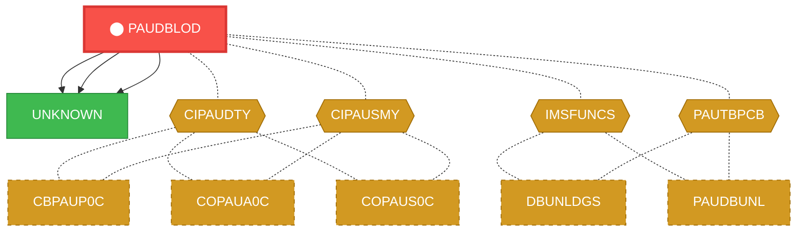
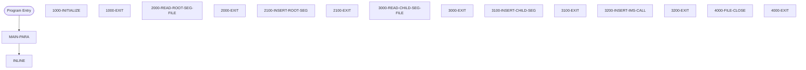

# Program: PAUDBLOD

---

## Quick Reference

| Attribute | Value |
|-----------|-------|
| Program ID | `PAUDBLOD` |
| Type | BATCH |
| Lines | 370 |
| Source | [PAUDBLOD.CBL](../carddemo\app/PAUDBLOD.CBL#L1) |
| Paragraphs | 17 |
| Statements | 51 |
| Impact Risk | **MEDIUM** — 7 programs affected |

> **View Source:** [Open PAUDBLOD.CBL](../carddemo\app/PAUDBLOD.CBL#L1)

## Dependency Context

> This section shows how **PAUDBLOD** connects to the rest of the system — who calls it,
> what it calls, and what data it shares. If linked programs exist, they must appear here.

### Programs That Call PAUDBLOD (Callers)

*No programs call PAUDBLOD — this is likely a top-level entry point or CICS transaction starter.*

### Programs Called by PAUDBLOD (Callees)

| Called Program | Type | Line | Why |
|----------------|------|------|-----|
| [UNKNOWN](UNKNOWN.md) | None | 382 |  |
| [UNKNOWN](UNKNOWN.md) | None | 434 |  |
| [UNKNOWN](UNKNOWN.md) | None | 459 |  |

### Shared Data (Copybooks & Files)

#### Shared Copybooks

| Copybook | Also Used By | # Co-Users |
|----------|-------------|------------|
| `CIPAUDTY` | CBPAUP0C, COPAUA0C, COPAUS0C, COPAUS1C, COPAUS2C (+2 more) | 7 |
| `CIPAUSMY` | CBPAUP0C, COPAUA0C, COPAUS0C, COPAUS1C, DBUNLDGS (+1 more) | 6 |
| `IMSFUNCS` | DBUNLDGS, PAUDBUNL | 2 |
| `PAUTBPCB` | DBUNLDGS, PAUDBUNL | 2 |

---

## Dependency Graph

> **Legend:** 🔴 Target program · 🔵 Direct callers · 🟢 Direct callees · 🟡 Copybook-coupled · ⚫ Transitive (indirect)

---

## Impact Ripple View

> **If you change PAUDBLOD, what else could break?**

| Impact Metric | Count |
|--------------|-------|
| Direct Callers | 0 |
| Transitive Callers (callers of callers) | 0 |
| Direct Callees | 0 |
| Transitive Callees | 0 |
| Copybook-Coupled Programs | 7 |
| **Total Impact** | **7** |
| **Risk Rating** | **MEDIUM** |

**Programs affected via shared copybooks:**
- `CBPAUP0C`
- `COPAUA0C`
- `COPAUS0C`
- `COPAUS1C`
- `COPAUS2C`
- `DBUNLDGS`
- `PAUDBUNL`

---

## Statement Profile

| Statement Type | Count |
|---------------|-------|
| IF | 13 |
| DISPLAY | 10 |
| EXIT | 8 |
| PERFORM | 4 |
| CALL | 3 |
| READ | 2 |
| OPEN | 2 |
| GOBACK | 2 |
| CLOSE | 2 |
| ACCEPT | 2 |
| MOVE | 1 |
| INITIALIZE | 1 |
| ENTRY | 1 |

## Control Flow

## Paragraphs

### MAIN-PARA

| | |
|---|---|
| **Paragraph** | `MAIN-PARA` |
| **Lines** | 307 - 325 |
| **View Code** | [Jump to Line 307](../carddemo\app/PAUDBLOD.CBL#L307) |

### 1000-INITIALIZE

| | |
|---|---|
| **Paragraph** | `1000-INITIALIZE` |
| **Lines** | 328 - 353 |
| **View Code** | [Jump to Line 328](../carddemo\app/PAUDBLOD.CBL#L328) |

### 1000-EXIT

| | |
|---|---|
| **Paragraph** | `1000-EXIT` |
| **Lines** | 356 - 357 |
| **View Code** | [Jump to Line 356](../carddemo\app/PAUDBLOD.CBL#L356) |

### 2000-READ-ROOT-SEG-FILE

| | |
|---|---|
| **Paragraph** | `2000-READ-ROOT-SEG-FILE` |
| **Lines** | 360 - 375 |
| **View Code** | [Jump to Line 360](../carddemo\app/PAUDBLOD.CBL#L360) |

### 2000-EXIT

| | |
|---|---|
| **Paragraph** | `2000-EXIT` |
| **Lines** | 377 - 378 |
| **View Code** | [Jump to Line 377](../carddemo\app/PAUDBLOD.CBL#L377) |

### 2100-INSERT-ROOT-SEG

| | |
|---|---|
| **Paragraph** | `2100-INSERT-ROOT-SEG` |
| **Lines** | 380 - 401 |
| **View Code** | [Jump to Line 380](../carddemo\app/PAUDBLOD.CBL#L380) |

### 2100-EXIT

| | |
|---|---|
| **Paragraph** | `2100-EXIT` |
| **Lines** | 402 - 403 |
| **View Code** | [Jump to Line 402](../carddemo\app/PAUDBLOD.CBL#L402) |

### 3000-READ-CHILD-SEG-FILE

| | |
|---|---|
| **Paragraph** | `3000-READ-CHILD-SEG-FILE` |
| **Lines** | 407 - 427 |
| **View Code** | [Jump to Line 407](../carddemo\app/PAUDBLOD.CBL#L407) |

### 3000-EXIT

| | |
|---|---|
| **Paragraph** | `3000-EXIT` |
| **Lines** | 428 - 429 |
| **View Code** | [Jump to Line 428](../carddemo\app/PAUDBLOD.CBL#L428) |

### 3100-INSERT-CHILD-SEG

| | |
|---|---|
| **Paragraph** | `3100-INSERT-CHILD-SEG` |
| **Lines** | 430 - 452 |
| **View Code** | [Jump to Line 430](../carddemo\app/PAUDBLOD.CBL#L430) |

### 3100-EXIT

| | |
|---|---|
| **Paragraph** | `3100-EXIT` |
| **Lines** | 453 - 454 |
| **View Code** | [Jump to Line 453](../carddemo\app/PAUDBLOD.CBL#L453) |

### 3200-INSERT-IMS-CALL

| | |
|---|---|
| **Paragraph** | `3200-INSERT-IMS-CALL` |
| **Lines** | 456 - 474 |
| **View Code** | [Jump to Line 456](../carddemo\app/PAUDBLOD.CBL#L456) |

### 3200-EXIT

| | |
|---|---|
| **Paragraph** | `3200-EXIT` |
| **Lines** | 476 - 477 |
| **View Code** | [Jump to Line 476](../carddemo\app/PAUDBLOD.CBL#L476) |

### 4000-FILE-CLOSE

| | |
|---|---|
| **Paragraph** | `4000-FILE-CLOSE` |
| **Lines** | 479 - 494 |
| **View Code** | [Jump to Line 479](../carddemo\app/PAUDBLOD.CBL#L479) |

### 4000-EXIT

| | |
|---|---|
| **Paragraph** | `4000-EXIT` |
| **Lines** | 495 - 496 |
| **View Code** | [Jump to Line 495](../carddemo\app/PAUDBLOD.CBL#L495) |

### 9999-ABEND

| | |
|---|---|
| **Paragraph** | `9999-ABEND` |
| **Lines** | 498 - 504 |
| **View Code** | [Jump to Line 498](../carddemo\app/PAUDBLOD.CBL#L498) |

### 9999-EXIT

| | |
|---|---|
| **Paragraph** | `9999-EXIT` |
| **Lines** | 506 - 507 |
| **View Code** | [Jump to Line 506](../carddemo\app/PAUDBLOD.CBL#L506) |

## Business Rules

*No business rules extracted yet. Run LLM enrichment to extract rules from IF/EVALUATE logic.*

## Key Data Items

| Name | Level | Picture | Section | Business Name |
|------|-------|---------|---------|---------------|
| `WS-VARIABLES` | 1 | `None` | WORKING-STORAGE | None |
| `WS-PGMNAME` | 5 | `X(08)` | WORKING-STORAGE | None |
| `CURRENT-DATE` | 5 | `9(06)` | WORKING-STORAGE | None |
| `CURRENT-YYDDD` | 5 | `9(05)` | WORKING-STORAGE | None |
| `WS-AUTH-DATE` | 5 | `9(05)` | WORKING-STORAGE | None |
| `WS-EXPIRY-DAYS` | 5 | `S9(4)` | WORKING-STORAGE | None |
| `WS-DAY-DIFF` | 5 | `S9(4)` | WORKING-STORAGE | None |
| `IDX` | 5 | `S9(4)` | WORKING-STORAGE | None |
| `WS-CURR-APP-ID` | 5 | `9(11)` | WORKING-STORAGE | None |
| `WS-NO-CHKP` | 5 | `9(8)` | WORKING-STORAGE | None |
| `WS-AUTH-SMRY-PROC-CNT` | 5 | `9(8)` | WORKING-STORAGE | None |
| `WS-TOT-REC-WRITTEN` | 5 | `S9(8)` | WORKING-STORAGE | None |
| `WS-NO-SUMRY-READ` | 5 | `S9(8)` | WORKING-STORAGE | None |
| `WS-NO-SUMRY-DELETED` | 5 | `S9(8)` | WORKING-STORAGE | None |
| `WS-NO-DTL-READ` | 5 | `S9(8)` | WORKING-STORAGE | None |
| `WS-NO-DTL-DELETED` | 5 | `S9(8)` | WORKING-STORAGE | None |
| `WS-ERR-FLG` | 5 | `X(01)` | WORKING-STORAGE | None |
| `ERR-FLG-ON` | 88 | `None` | WORKING-STORAGE | None |
| `ERR-FLG-OFF` | 88 | `None` | WORKING-STORAGE | None |
| `WS-END-OF-AUTHDB-FLAG` | 5 | `X(01)` | WORKING-STORAGE | None |
| `END-OF-AUTHDB` | 88 | `None` | WORKING-STORAGE | None |
| `NOT-END-OF-AUTHDB` | 88 | `None` | WORKING-STORAGE | None |
| `WS-MORE-AUTHS-FLAG` | 5 | `X(01)` | WORKING-STORAGE | None |
| `MORE-AUTHS` | 88 | `None` | WORKING-STORAGE | None |
| `NO-MORE-AUTHS` | 88 | `None` | WORKING-STORAGE | None |
| `WS-END-OF-INFILE1` | 5 | `X(01)` | WORKING-STORAGE | None |
| `WS-END-OF-INFILE2` | 5 | `X(01)` | WORKING-STORAGE | None |
| `WS-INFILE-STATUS` | 5 | `X(02)` | WORKING-STORAGE | None |
| `WS-INFIL1-STATUS` | 5 | `X(02)` | WORKING-STORAGE | None |
| `WS-INFIL2-STATUS` | 5 | `X(02)` | WORKING-STORAGE | None |
| `END-ROOT-SEG-FILE` | 5 | `X(01)` | WORKING-STORAGE | None |
| `END-CHILD-SEG-FILE` | 5 | `X(01)` | WORKING-STORAGE | None |
| `WS-CUSTID-STATUS` | 5 | `X(02)` | WORKING-STORAGE | None |
| `END-OF-FILE` | 88 | `None` | WORKING-STORAGE | None |
| `WK-CHKPT-ID` | 5 | `None` | WORKING-STORAGE | None |
| `FILLER` | 10 | `X(04)` | WORKING-STORAGE | None |
| `WK-CHKPT-ID-CTR` | 10 | `9(04)` | WORKING-STORAGE | None |
| `WS-IMS-VARIABLES` | 1 | `None` | WORKING-STORAGE | None |
| `IMS-RETURN-CODE` | 5 | `X(02)` | WORKING-STORAGE | None |
| `STATUS-OK` | 88 | `None` | WORKING-STORAGE | None |

*Showing 40 of 148 data items. See [Data Dictionary](../data-dictionary.md).*

---

*Generated 2026-03-16 19:39*